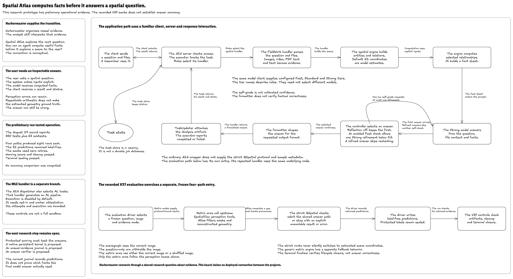
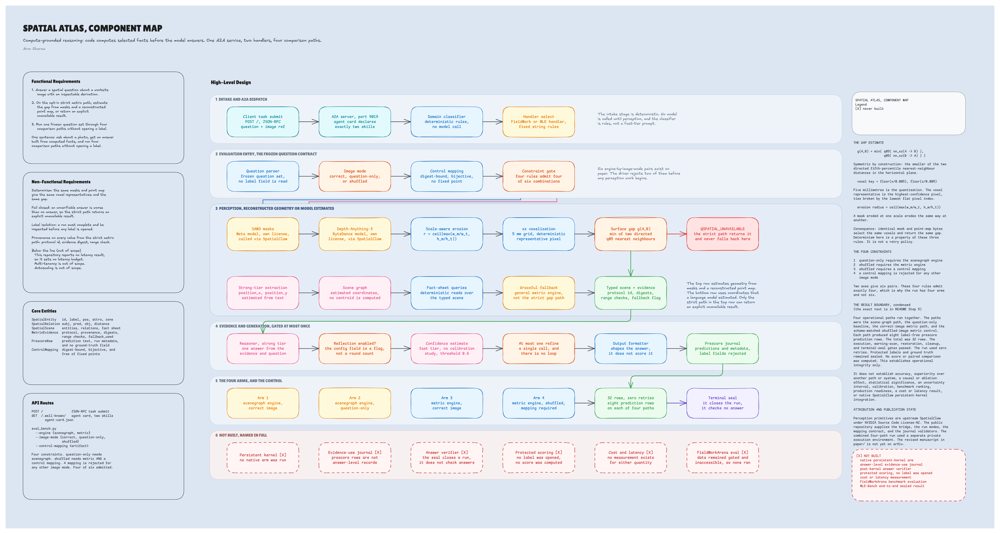

<h1 align="center">Spatial Atlas: A Compute-Grounded Spatial Reasoning Agent</h1>

<p align="center">
  <a href="https://github.com/arunshar/spatial-atlas-agent/actions/workflows/ci.yml"></a>
  <a href="LICENSE"></a>
  <a href="pyproject.toml"></a>
</p>

<p align="center">
  <a href="assets/diagrams/agent-workflow.png"></a>
</p>

This figure is the agent workflow board that I drew in Codex. Select the figure to open it at full size. The same board is also available as an [SVG file](assets/diagrams/agent-workflow.svg) and as its [Excalidraw source](assets/diagrams/src/agent-workflow.excalidraw). The board shows my working view of the project, and a few of its phrases are less precise than the text of this README. The panel titled "Harbormaster supplies the transition" describes a conceptual link to Harbormaster. Harbormaster is my separate research prototype for organizing vessel evidence, and this README makes no claim about its deployment or accuracy. This repository contains no Harbormaster code. The board also says "The August 29 record reports 350 tests plus 63 subtests." Step 5 quotes the dated V37 record word for word. This repository does not state that record's date, so it cannot confirm the board's date. When the board and this README differ, the README text is correct.

I built Spatial Atlas, an agent for compute-grounded spatial reasoning. It speaks the Agent-to-Agent (A2A) protocol, which carries tasks between agents as JSON-RPC over HTTP. A client can send a spatial question with images, video, PDFs, or text. The agent records the scene evidence in a typed structure called a scene graph, and ordinary code computes selected facts such as distances and rule violations. A language model then writes the answer with those facts in its prompt.

I first built it for the AgentX-AgentBeats competition, which Berkeley's Center for Responsible, Decentralized Intelligence (RDI) runs. The competition sends two kinds of tasks. FieldWorkArena tasks ask spatial questions about factory, warehouse, and retail scenes. MLE-Bench (machine learning engineering benchmark) tasks ask the agent to train a model for a Kaggle competition and write a submission file. The server has one handler for each kind, called the FieldWork handler and the MLE handler. Code execution in the MLE handler is disabled by default.

The default spatial engine does 2D scene-graph arithmetic over model-estimated coordinates. The arithmetic repeats exactly for the same inputs, but a language model supplies the coordinates, so the scene graph does not measure physical geometry. An opt-in metric bridge builds geometry from segmentation masks and a reconstructed point map. The bridge calls NVIDIA's upstream SpatialClaw tools, and this repository does not include those tools. The only run-level evidence is one private, label-free smoke run called V37. A smoke run is a short run that checks whether each path executes and closes cleanly. V37 exercised the four paths that Step 5 defines. It computed no score. This repository reports no accuracy, cost, or latency result.

## Who this is for

- **Engineers** who want to run or extend the server should read [Quick start](#quick-start), [Step 1](#step-1-a2a-intake-and-dispatch), and [Runtime safety settings](#runtime-safety-settings). [docs/GUIDE.md](docs/GUIDE.md) gives the full setup.
- **Researchers** who care about the method should read [Steps 3 to 5](#step-3-the-scene-graph-and-the-fact-sheet) and [Evaluation](#evaluation). [docs/EXPLAINED.md](docs/EXPLAINED.md) and the [revised manuscript](paper/spatial_atlas.pdf) give the ideas and equations.
- **Reviewers** who want to check the claims should read the opening paragraphs above, [Evaluation](#evaluation), and [What is not built](#what-is-not-built). Each claim in those sections points to code or to a stated limit.

## Table of contents

- [Quick start](#quick-start)
- [System overview](#system-overview)
- [Step 1: A2A intake and dispatch](#step-1-a2a-intake-and-dispatch)
- [Step 2: Perception, with an opt-in path through upstream SpatialClaw tools](#step-2-perception-with-an-opt-in-path-through-upstream-spatialclaw-tools)
- [Step 3: The scene graph and the fact sheet](#step-3-the-scene-graph-and-the-fact-sheet)
- [Step 4: Generation and the single refinement rule](#step-4-generation-and-the-single-refinement-rule)
- [Step 5: The four arms and the V37 operational check](#step-5-the-four-arms-and-the-v37-operational-check)
- [Runtime safety settings](#runtime-safety-settings)
- [Docker](#docker)
- [Evaluation](#evaluation)
- [What is not built](#what-is-not-built)
- [Code tree](#code-tree)
- [Paper, poster, and deeper docs](#paper-poster-and-deeper-docs)
- [License and attribution](#license-and-attribution)
- [Citation](#citation)

## Quick start

You need [`uv`](https://docs.astral.sh/uv/). It reads `.python-version` and uses Python 3.13, which it downloads when needed. `pyproject.toml` also allows Python 3.12, and you can select it by adding `--python 3.12` to the `uv sync` and `uv run` commands.

```bash
git clone https://github.com/arunshar/spatial-atlas-agent.git
cd spatial-atlas-agent
uv sync --frozen --extra test
uv run pytest -m "not e2e and not gpu"
```

The tests need no API key, GPU, or SpatialClaw. Every test command in this README assumes that you already ran `uv sync --frozen --extra test`.

Add a model key and bind to loopback to start the server on your own machine.

```bash
cp sample.env .env            # then replace sk-... with your OpenAI API key
uv run src/server.py --host 127.0.0.1 --port 9019
```

The server keeps running in this terminal. Open a second terminal to fetch the agent card, and press Ctrl+C in the first terminal to stop the server.

```bash
curl -s http://127.0.0.1:9019/.well-known/agent-card.json
```

Run `uv run python eval_smoke.py` to send one synthetic task to the local server. The client exits with code 1 when the task ends in any state other than completed. When the task fails, the client prints a short reference code. Search the server's terminal output for that code to see the exception type. A missing or invalid model key is one common cause. The smoke client sends no bearer token, so use it only against a loopback server that has no token set. [docs/GUIDE.md](docs/GUIDE.md) covers the metric engine, the evaluation entry, and troubleshooting.

## System overview

The board at the top of this page has two halves, and a column of five summary panels is on its left side. The panels cover the link to Harbormaster, the user's need for an inspectable answer, and the preliminary V37 run. They also cover the separate MLE handler and the next research step, which remains open.

The top half is the application path. A client sends a question, and the A2A server checks access. Fixed rules then pick a handler, and the FieldWork handler turns files into evidence. The spatial engine builds a scene and a fact sheet. The Strong tier writes the answer, and a controller allows at most one refinement. The formatter shapes the answer, and `TaskUpdater` attaches it as the `Analysis` artifact. The server names four model tiers (Fast, Standard, Strong, and Vision), and each tier maps to a configurable model. The board's note on tiers names only Fast, Standard, and Strong.

The bottom half is the separate evaluation entry that the V37 run exercised. It shares the FieldWork code but has its own driver, its own strict checks, and its own label-free journals. The last box in that row, "The V37 controls check artifacts, cleanup and terminal closure," shows the private V37 orchestration. This repository does not include that orchestration or its warning-scan, restoration, cleanup, and terminal-seal gates.

<a href="assets/diagrams/component-map.png"></a>

Select the component map to open it at full size. The map is also available as an [SVG file](assets/diagrams/component-map.svg) and as its [Excalidraw source](assets/diagrams/src/component-map.excalidraw). As with the workflow board, when the map and this README differ, the README text is correct.

The component map splits the same system into six lanes. Lane 1 is A2A intake, and lane 2 is the frozen question contract for evaluation. Lane 2 describes the label-free strict QSpatial mode. For other SpatialClaw benchmarks, the driver can load labels and write a scored journal. Lane 3 is perception, and lane 4 is evidence and generation. Lane 5 holds the four comparison arms, and lane 6 names six parts I never built. Lane 1 serves the A2A path, and lanes 2 and 5 belong to the separate evaluation entry.

Boxes tagged `[X]` were never built. The "Cost and latency" box in lane 6 means that no cost or latency result exists. The evaluation driver still records the latency and token usage of each row. Two untagged boxes in lane 5 describe the private V37 run, and this repository has no code for them. The box "32 rows, zero retries" reports that run's output. The "Terminal seal" box is a V37 gate, and this repository does not include it. The lane 6 header reads "NOT BUILT, NAMED IN FULL." The full list in [What is not built](#what-is-not-built) has four more items. They are a sealed MLE-Bench result, a one-command orchestrator, a complete security sandbox for the MLE path, and a durable task store.

The left column lists the functional requirements, the non-functional requirements, the core entities, and the API routes. The right margin restates the gap formula from Step 2 and the four arm constraints from Step 5. It also gives a condensed form of the V37 result boundary, an attribution note, and the list of parts I never built. The exact boundary wording appears in Step 5.

The first functional requirement names an inspectable derivation. The A2A path returns only the formatted answer, so a client cannot see the scene graph or the fact sheet. `SpatialEntity`, `SpatialRelation`, and `SpatialScene` are classes in `src/fieldwork/spatial.py`. The `SpatialScene` class also holds zones, safety rules, and violations, and its `to_fact_sheet()` method writes the fact sheet. `MetricEvidence`, `PrescoreRow`, and `ControlMapping` are descriptive names for dictionary records and a mapping file, and no class carries those names.

The repository has two entry points into the same FieldWork code.

| Entry point | Who calls it | What it runs |
| --- | --- | --- |
| `src/server.py` | An A2A client over HTTP | Admission control, bearer-token auth, rule dispatch, and both handlers |
| `eval_bench.py` | An operator on the command line | The FieldWork handler, called directly, with frozen run modes, strict metric checks, and label-free journals for strict QSpatial rows |

## Step 1: A2A intake and dispatch

A client sends a JSON-RPC task to the A2A server as `POST /`. Before the request reaches any model, the server applies three admission layers in a fixed order. A concurrency limit comes first, a bearer-token check comes second, and a body-size limit comes third. The A2A SDK then hands the message to the executor, which builds a fresh `Agent` for this one A2A execution. The Agent splits the message into text and files and picks a handler with four fixed string rules. No model call takes part in this choice. This is lane 1 of the component map. Lane 1 labels the request "question + image ref." The Agent reads only inline file bytes, and it ignores a file part that carries only a URI.

### What can go wrong and what I changed

A server on a public address with no token would accept any POST from anyone. Startup now stops when the server binds to a non-loopback address without a bearer token of at least 32 characters. A burst of requests could also start many model calls at once, so the server answers HTTP 503 when 4 non-read-only requests are already active. GET, HEAD, and OPTIONS requests never use a slot. The executor builds a fresh Agent for each execution, so each execution gets its own model-token budget. This holds even when a message references an earlier A2A task ID. Step 4 explains the budget. A failed task returns a sanitized message with a short reference code, and the client never sees exception text.

`src/agent.py` defines the dispatch rules.

```python
# src/agent.py, lines 183-198
        # Check for MLE-Bench tar file
        for name, mime, _data in file_parts:
            if name and ("competition" in name.lower() or name.endswith(".tar.gz")):
                return "mlebench"
            if mime and "gzip" in mime:
                return "mlebench"

        # Check for FieldWorkArena goal format
        text_lower = text.lower()
        if "# question" in text_lower and "# output format" in text_lower:
            return "fieldwork"

        # Check for MLE-Bench keywords
        mle_keywords = ["kaggle", "mle-bench", "competition", "submission.csv", "train a model"]
        if any(kw in text_lower for kw in mle_keywords):
            return "mlebench"
```

Every other task goes to the FieldWork handler. Use this command to run the intake tests.

```bash
uv run pytest tests/test_agent.py tests/test_request_size_middleware.py tests/test_task_failure_lifecycle.py
```

Section 2 of [docs/ARCHITECTURE.md](docs/ARCHITECTURE.md#2-the-a2a-request-path) traces every admission layer and status code.

## Step 2: Perception, with an opt-in path through upstream SpatialClaw tools

The FieldWork handler parses the goal into a question, input data, and an output format. By default, a vision model describes each image, `pypdf` extracts PDF text, and video is sampled into at most 30 frames. When an operator sets `ATLAS_FIELDWORK_ENGINE=metric`, the handler uses the metric bridge in `src/fieldwork/perception.py`. The bridge calls two perception tools through NVIDIA's SpatialClaw project. SAM3 (Segment Anything Model 3) supplies object masks, and Depth-Anything-3 supplies a point map with a confidence value for each point. SpatialClaw, its GPU tool server, and its tool wrappers belong to NVIDIA. Meta publishes SAM3, and ByteDance publishes Depth-Anything-3. The weights of each model carry their own license. This repository includes none of them.

On the A2A path, this generic metric engine asks the Fast tier for up to six object phrases and segments each phrase with SAM3. It then reads a ground-plane (x, z) position and a visible height for each object from the Depth-Anything-3 point map. The evaluation entry in Step 5 can request a stricter protocol, `qspatial-horizontal-gap-v1`, and the A2A path never sends it. On that strict path, Spatial Atlas erodes each mask and rejects a mask pair that overlaps by 5 percent or more. It keeps points with confidence above 0.3 and groups them into 5 mm voxels on the horizontal XZ plane. It then computes the fifth-percentile nearest-neighbor distance in each direction between the two objects and keeps the smaller value as the gap. The strict path is the top row of lane 3 in the component map.

### What can go wrong and what I changed

The metric bridge output is an estimate, because mask, depth, scale, and occlusion errors can reach the fact sheet.

NVIDIA's public SpatialClaw finds its GPU server through the registry file `logs/gpu_server.json`. SpatialClaw polls for about four hours when that file lists no live server. A laptop with the package installed but no GPU server can therefore hang silently. My local SpatialClaw checkout adds a `SPATIALCLAW_GPU_SERVER_URL` override that pins one server address, so a call to an unreachable address fails within seconds. NVIDIA's public release does not read this variable, so the loopback default below shortens the wait only with that local change.

```python
# src/fieldwork/perception.py, lines 806-811
        os.environ.setdefault("SPATIALCLAW_GPU_SERVER_URL", "http://127.0.0.1:1")

        # Imported lazily: only available where the SpatialClaw package is installed
        # (a GPU agent environment), so the API service stays importable without it.
        from spatial_agent.tools.reconstruct_tool import ReconstructTool
        from spatial_agent.tools.sam3_tool import SAM3Tool
```

The gap estimator is Atlas code. It takes the smaller of two directed fifth-percentile nearest-neighbor distances.

```python
# src/fieldwork/perception.py, lines 423-429
    tree_a = cKDTree(voxel_points[0])
    tree_b = cKDTree(voxel_points[1])
    distances_a_to_b = tree_b.query(voxel_points[0], k=1, workers=1)[0]
    distances_b_to_a = tree_a.query(voxel_points[1], k=1, workers=1)[0]
    directed_a_to_b = float(np.quantile(distances_a_to_b, 0.05, method="linear"))
    directed_b_to_a = float(np.quantile(distances_b_to_a, 0.05, method="linear"))
    gap_m = min(directed_a_to_b, directed_b_to_a)
```

The perception tests use in-memory fakes, so they run without SpatialClaw or a GPU.

```bash
uv run pytest tests/test_perception.py tests/test_perception_contract.py tests/test_perception_property.py
```

## Step 3: The scene graph and the fact sheet

The default engine asks the Strong tier to turn the evidence text into JSON. The JSON lists entities, relations, zones, and safety rules, and each entity may carry `position_x` and `position_y`. The model estimates these coordinates from text descriptions of the image, so they are estimates and not measurements. Code in `src/fieldwork/spatial.py` then runs deterministic operations over them. It computes Euclidean distances, finds entities within a radius, checks the extracted rules, and writes a fact sheet for the answer prompt. The first three boxes in the bottom row of lane 3 show this engine. The last two boxes, "Graceful fallback" and "Typed scene + evidence," describe the metric bridge. The default scene graph carries no protocol id, digests, or range checks.

### What can go wrong and what I changed

Correct arithmetic cannot repair a wrong coordinate, so an estimation error carries into every fact derived from it. The engine keeps any distance the model already supplied, and the scene does not record which distances the code computed. A missing hard-hat or vest attribute counts as compliant, so missing evidence can hide a violation. When extraction returns invalid JSON, the engine returns an empty scene and the prompt carries no fact sheet. I have not fixed these limits in code. I changed the claims to match them, so the docs and the paper describe these values as model-estimated coordinates.

```python
# src/fieldwork/spatial.py, lines 66-74
    def compute_distance(self, id_a: str, id_b: str) -> float | None:
        """Compute Euclidean distance between two entities."""
        a = self.entities.get(id_a)
        b = self.entities.get(id_b)
        if not a or not b or not a.position or not b.position:
            return None
        dx = a.position[0] - b.position[0]
        dy = a.position[1] - b.position[1]
        return math.sqrt(dx * dx + dy * dy)
```

```bash
uv run pytest tests/test_spatial_comprehensive.py
```

Section 5 of [docs/EXPLAINED.md](docs/EXPLAINED.md#5-the-fieldwork-path) states what the graph establishes and what it does not.

## Step 4: Generation and the single refinement rule

The reasoner builds one prompt from the question, the file evidence, the fact sheet, and the output format. The Strong tier writes an answer. The Fast tier then grades that answer with a number from 0.0 to 1.0. When the grade is below 0.6, the Strong tier writes one refinement, and no second refinement follows. The formatter finally shapes the answer to the requested format, such as JSON, a number, or yes or no. The Agent returns the result as an artifact named `Analysis`. This is lane 4 of the component map. The last box in lane 4, the prescore journal, belongs to the evaluation entry. The map does not draw the `Analysis` artifact that the A2A path returns.

Every model call on the public A2A path goes through `BudgetedLLMClient`. It enforces a heuristic budget of 150,000 tokens per execution. Before each call, it estimates the prompt size and reserves that estimate plus the allowed maximum completion under a lock. When the remaining budget cannot cover the prompt estimate, the client raises `TokenBudgetExceeded` before the call reaches the provider. The lock makes the counter concurrency-safe, so parallel calls within one A2A execution cannot oversubscribe it. Provider-reported usage remains the authoritative record, because the estimate is not exact tokenizer accounting.

### What can go wrong and what I changed

An earlier write-up described an expected-information-gain policy that chose among reasoning actions. The request path never calls that selector, which is still defined in `src/entropy/engine.py`. The docs now describe the controller that runs. When the grading reply cannot be parsed, the grade defaults to 0.5, so a refinement runs. The grade is a routing heuristic, and no study in this repository shows that it is calibrated. The formatter also does not verify that the answer is correct.

```python
# src/fieldwork/reasoner.py, lines 95-108
        # Entropy-guided confidence check: refine if low confidence
        if self.config.max_reflection_rounds > 0:
            confidence = await self.entropy.estimate_confidence(
                answer=answer,
                evidence=evidence[:2000],
                query=query,
            )
            logger.info(f"Answer confidence: {confidence:.2f}")

            if confidence < 0.6:
                logger.info("Low confidence: reflecting and refining answer")
                answer = await self._refine_answer(
                    query, answer, evidence[:6000], spatial_section, output_format
                )
```

The code comment still says entropy-guided. The call is one self-grade from the Fast tier, and no entropy calculation runs.

```bash
uv run pytest tests/test_handler_engine.py tests/test_llm_budget_enforcement.py
```

## Step 5: The four arms and the V37 operational check

`eval_bench.py` loads a benchmark through the benchmark factory in a SpatialClaw checkout, and it calls the FieldWork handler directly on each row. Its strict metric checks target the QSpatial++ split of Q-Spatial Bench, which the rest of this README calls QSpatial. These questions ask for the horizontal gap between two objects. The driver supports four run modes, and each mode is one arm of a comparison design. The scene-graph path sends the question with its own image. The question-only baseline withholds the image. The correct-image metric path sends the question and its own image through the strict metric bridge. The schema-matched shuffled-image metric control sends a different image chosen by a frozen, digest-bound mapping in which no question receives its own image. This step covers lanes 2 and 5 of the component map.

The driver writes label-free journals under the `label_free_prescore_v1` schema for the strict QSpatial horizontal-gap rows. Prescore means the driver writes these rows before any scoring step. The driver rejects any row that contains a label-shaped key such as `gt`, `answer`, `score`, or `label`. The journals record predictions and run metadata. They do not record which evidence an answer used.

### What can go wrong and what I changed

On the A2A path, the generic metric engine has a documented fallback to the scene graph when the bridge fails. Inside an evaluation, that fallback would let a metric arm silently answer from estimated coordinates, and the arms would stop being distinct. The strict metric bridge returns an explicit unavailable result instead of silently falling back. A service error or a failed validation raises an error, and the driver records it in the journal row. The command line also rejects arm combinations that the design does not allow.

```python
# eval_bench.py, lines 211-218
    if args.image_mode == "question-only" and args.engine != "scenegraph":
        parser.error("--image-mode question-only requires --engine scenegraph")
    if args.image_mode == "shuffled" and args.engine != "metric":
        parser.error("--image-mode shuffled requires --engine metric")
    if args.image_mode == "shuffled" and not args.control_mapping:
        parser.error("--image-mode shuffled requires --control-mapping")
    if args.image_mode != "shuffled" and args.control_mapping:
        parser.error("--control-mapping is valid only with --image-mode shuffled")
```

```python
# src/fieldwork/handler.py, lines 150-156
                    if scene is None:
                        logger.info(
                            "QSpatial metric grounding unavailable: %s",
                            evidence["geometry"]["invalid_reason"],
                        )
                        return QSPATIAL_UNAVAILABLE
                    validate_qspatial_gap_scene(scene, evidence)
```

`QSPATIAL_UNAVAILABLE` is the literal answer `measurement unavailable`. The handler returns it before the reasoner runs.

```bash
uv run pytest tests/test_eval_bench.py
```

I ran the four arms once in a private execution environment, and that run is called V37. The public repository alone cannot reproduce V37. Every arm needs a SpatialClaw checkout and the benchmark data, because the driver loads questions and images through SpatialClaw's benchmark factory. The metric arms need a GPU tool server and private control artifacts as well. The strict QSpatial arms need a `qspatial_gap` benchmark loader that I wrote inside a local SpatialClaw checkout. NVIDIA's public SpatialClaw does not include this loader. The loader extends SpatialClaw's benchmark classes, so it falls under NVIDIA's Source Code License-NC. This repository does not include the loader for that reason. The private orchestration that ran the four arms together is not in this repository either. The boundary below is copied exactly from the project's evidence record. The record was written as guidance for anyone who describes the run, so it opens with an instruction to the writer.

> The new Spatial Atlas result is a label-free operational validation. Use this wording and no stronger interpretation:
>
> 1. Four operational paths ran together.
> 2. The paths were the scene-graph path, question-only baseline, correct-image metric path, and schema-matched shuffled-image metric control.
> 3. Each path produced eight label-free prescore prediction rows.
> 4. The total was 32 rows.
> 5. The execution, warning-scan, restoration, cleanup, and terminal-seal gates passed.
> 6. The run used zero retries.
> 7. Protected labels and ground truth remained sealed.
> 8. No score or paired comparison was computed.
> 9. This establishes operational integrity only.
>
> It does not establish:
>
> 1. Accuracy.
> 2. Superiority over another path or system.
> 3. A causal or ablation effect.
> 4. Statistical significance.
> 5. An uncertainty interval.
> 6. Calibration.
> 7. Benchmark ranking.
> 8. Production readiness.
> 9. A cost or latency result.
> 10. Native SpatialClaw persistent-kernel integration.
>
> The local regression suite reported 350 tests plus 63 subtests in the dated V37 record. Treat that as `LOCAL_REGRESSION_PASS`, not benchmark accuracy.
>
> Prediction journals are not answer-level evidence-use journals. The terminal finalizer is not an answer verifier. The V37 metric arm used SpatialClaw perception primitives through the Atlas bridge, but V37 did not run a native SpatialClaw persistent-kernel arm.

In that record, `LOCAL_REGRESSION_PASS` is the evidence class for a local test suite that passed against a frozen control. The record says that all eight bounded logs passed the required warning scan. It describes the restoration gate as a registry restoration and the cleanup gate as a check that a job-local authentication artifact was absent after teardown. The terminal-seal gate and the terminal finalizer wrote a closed final record of the run, and neither one checked an answer.

## Runtime safety settings

These environment variables control the public A2A server. `sample.env` holds placeholders for the model key and the bearer token.

| Variable | Default | Effect |
| --- | --- | --- |
| `OPENAI_API_KEY` | Unset | It supplies the key for the default model tiers, which call OpenAI models through LiteLLM. LiteLLM is a library that calls many model providers through one interface. |
| `ATLAS_FAST_MODEL`, `ATLAS_STANDARD_MODEL`, `ATLAS_STRONG_MODEL`, `ATLAS_VISION_MODEL` | `openai/gpt-4.1-mini` for Fast, `openai/gpt-4.1` for the rest | Each value needs a provider prefix, and startup stops without one. [docs/GUIDE.md](docs/GUIDE.md#3-add-a-model-key) lists what each tier does. |
| `ATLAS_BEARER_TOKEN` | Unset | Requests other than GET, HEAD, and OPTIONS must send it. It must have at least 32 characters. |
| `ATLAS_MAX_REQUEST_BYTES` | 64 MiB | The server answers 413 for a larger body. |
| `ATLAS_MAX_CONCURRENT_REQUESTS` | 4 | The server answers 503 when this many non-read-only requests are already active. |
| `ATLAS_ENABLE_MLEBENCH_CODE_EXECUTION` | Disabled | This flag allows generated-code execution in the MLE handler. |
| `ATLAS_TRUSTED_ISOLATED_WORKER` | Disabled | This flag attests that the process runs in an isolated, trusted worker. |
| `ATLAS_ALLOW_DUMMY_SUBMISSION` | Disabled | This flag allows a placeholder submission after every real attempt fails. |
| `ATLAS_ALLOW_UNAUTHENTICATED_PUBLIC` | Disabled | This test-only override lets a non-loopback server start without a token. Never use it for a deployment. |
| `ATLAS_FIELDWORK_ENGINE` | `scenegraph` | Setting `metric` turns on the metric bridge from Step 2. |
| `PUBLIC_URL` | Unset | The agent card advertises this URL. Without it, the card advertises the bind address, such as `http://0.0.0.0:9019/`. The `--card-url` flag overrides both. |

A normal non-loopback bind always requires the bearer token, even when code execution is disabled. Only loopback development may omit it.

The MLE handler is a separate branch, and its code execution is off by default. Execution needs both `ATLAS_ENABLE_MLEBENCH_CODE_EXECUTION=true` and `ATLAS_TRUSTED_ISOLATED_WORKER=true`, and startup then also requires the bearer token. When execution is enabled, each generated pipeline runs in a subprocess with a 600-second timeout and a minimal environment. The handler makes at most 3 total attempts, and it repairs the code from the captured error between attempts. When every attempt fails, the task fails, unless dummy submissions were separately enabled. The pipeline prints its own validation score, so that score is a self-reported proxy that no independent check verifies. These controls reduce risk, but the subprocess is not a complete security sandbox.

The frozen benchmark driver in `eval_bench.py` uses the base `LLMClient`, which only records usage. The driver applies no per-execution reservation, and it writes each row's usage counts into the journal artifacts.

## Docker

The Dockerfile starts the server with `--host 0.0.0.0`, which is a non-loopback address. The container therefore needs `ATLAS_BEARER_TOKEN` in `.env`, and the token must have at least 32 characters. Startup stops without it.

```bash
python3 -c "import secrets; print(secrets.token_urlsafe(32))"   # put the output in .env as ATLAS_BEARER_TOKEN
docker build -t spatial-atlas-agent .
docker run --rm -p 9019:9019 --env-file .env -e PUBLIC_URL=http://127.0.0.1:9019/ spatial-atlas-agent --host 0.0.0.0 --port 9019
```

The server answers read-only requests without the token, so anyone can fetch the agent card.

```bash
curl -s http://127.0.0.1:9019/.well-known/agent-card.json
```

Every POST must carry the header `Authorization: Bearer <ATLAS_BEARER_TOKEN>`, and the server answers 401 without it. The image holds `src/`, the project metadata, the LICENSE and NOTICE files, the license texts in `LICENSES/`, and the locked runtime dependencies. It does not include the tests, the evaluation entry, or SpatialClaw.

## Evaluation

This table lists every test or run result that this repository reports.

| What | Result | Source and scope |
| --- | --- | --- |
| Frozen V37 control suite | Passed 350 tests plus 63 subtests | It comes from a private dated V37 record that this repository does not include. The suite checks software behavior against a frozen control. |
| V37 private four-arm smoke run | 4 arms, 8 label-free rows per arm, 32 rows total, zero retries | It comes from one private run, and no score was computed. |
| This repository, continuous integration (CI) test command | 323 passed, 1 deselected | This comes from a local run of the CI test command on 2026-09-22 with Python 3.13. The deselected case is the end-to-end test marked `e2e`, which needs a GPU tool server and the dataset. |
| Coverage of `src/fieldwork/perception.py` | 92.09% | The same CI command reports it, and CI requires at least 90%. |

These numbers have limits, and none of them measures answer quality. The 350 tests and 63 subtests show that the frozen control code behaves as its tests expect. A local run of this repository can report a different count. The V37 smoke run shows that four paths ran and closed cleanly with labels sealed. It gives no accuracy, superiority, causal, significance, calibration, ranking, production-readiness, cost, or latency result. This repository reports no FieldWorkArena result, because the benchmark data stayed gated and inaccessible. It reports no MLE-Bench result either, because no sealed end-to-end run artifact exists. The next scientific phase is protected scoring, paired analysis, and uncertainty analysis, and none of it has been performed.

An earlier version of the paper is on arXiv as [2604.12102v2](https://arxiv.org/abs/2604.12102v2). That version reported values that the current repository cannot tie to sealed run artifacts. The revised manuscript in [`paper/`](paper/) removes them, and it is not yet on arXiv.

## What is not built

This section lists the parts that I have not built and the evaluations that have not run.

- The repository has no native SpatialClaw persistent-kernel arm, and persistent-kernel integration is proposed future work.
- The repository has no answer-level evidence-use journal. The current journals record predictions and run metadata, and an evidence-use journal is proposed future work.
- The repository has no post-kernel answer verifier. The V37 terminal finalizer checks lifecycle closure only, and an answer verifier is proposed future work.
- Protected scoring has not run. No label was opened, and no score or paired comparison was computed.
- No cost or latency result exists. The evaluation driver records each row's wall-clock latency and token usage. It writes the run's mean latency, token counts, call count, and estimated cost in US dollars into `results_summary.json`. This repository reports none of these values.
- No FieldWorkArena evaluation ran. FieldWorkArena remained gated and inaccessible, so the project did not run its validation set.
- No sealed MLE-Bench end-to-end result exists.
- This repository has no one-command orchestrator for the four arms. The private V37 run used a separate combined orchestration, and this repository does not include it.
- The MLE path has no complete security sandbox for generated code.
- The server has no durable task store. Tasks live in process memory, so a restart loses them.

## Code tree

```text
spatial-atlas-agent/
├── src/                        # the A2A agent (MIT)
│   ├── server.py               # startup checks, admission layers, bearer auth, landing page, agent card
│   ├── executor.py             # task lifecycle, a fresh Agent per execution, sanitized failures
│   ├── agent.py                # message parsing and the four dispatch rules
│   ├── budgeted_llm.py         # heuristic per-execution token budget
│   ├── llm.py                  # LiteLLM wrapper with usage tracking
│   ├── config.py               # model tiers and tunable settings
│   ├── fieldwork/              # spatial question answering
│   │   ├── parser.py           # splits the goal into question, input data, and output format
│   │   ├── vision.py           # image, PDF, video, and text evidence
│   │   ├── detector.py         # optional Florence-2 detector, skipped in a default install
│   │   ├── spatial.py          # scene graph over model-estimated 2D coordinates, fact sheet
│   │   ├── perception.py       # metric bridge and strict QSpatial checks (calls SpatialClaw)
│   │   ├── reasoner.py         # answer, self-grade, at most one refinement
│   │   ├── formatter.py        # output-format matching
│   │   └── handler.py          # runs the five FieldWork stages and the engine choice
│   ├── mlebench/               # opt-in ML competition handler, executor, strategy templates
│   ├── entropy/                # self-grade, plus an action selector the request path never calls
│   └── cost/                   # usage tracker, plus a tier router the request path never calls
├── tests/                      # unit and integration tests (e2e and gpu tests skip by default)
├── eval_bench.py               # evaluation entry: four run modes, strict checks, label-free QSpatial journals
├── eval_smoke.py               # sends one synthetic A2A request to a running server
├── pyproject.toml              # project metadata, dependencies, and pytest options
├── uv.lock                     # locked dependency versions
├── .python-version             # selects Python 3.13 for uv
├── .github/workflows/ci.yml    # lint, security scan, and tests on every push
├── scenarios/                  # AgentBeats competition scenario files, which need the harness and its data
├── .well-known/agent-card.json # static example card (the running server builds its own)
├── docs/                       # ARCHITECTURE, GUIDE, and EXPLAINED
├── paper/                      # revised manuscript (.tex, .pdf, .md), not yet on arXiv
├── poster/                     # poster source, PDF, and preview image
├── assets/diagrams/            # the two figures in this README as PNG and SVG files, with their Excalidraw sources
├── Dockerfile                  # container that binds 0.0.0.0 and needs a bearer token
├── deploy_to_hf.sh             # copies the committed project into the Hugging Face Space named in HF_SPACE_REPO
├── sample.env                  # placeholder settings to copy into .env
├── NOTICE                      # attribution, SpatialClaw license note, dependency licenses
├── LICENSES/                   # full texts of the NVIDIA, Apache-2.0, and Comic Shanns licenses
└── LICENSE                     # MIT
```

## Paper, poster, and deeper docs

- [paper/spatial_atlas.pdf](paper/spatial_atlas.pdf) is the revised manuscript, with its [LaTeX source](paper/spatial_atlas.tex) and a [Markdown copy](paper/spatial_atlas.md). It is not yet on arXiv. The manuscript's title is "Spatial Atlas: Compute-Grounded Reasoning for Spatial-Aware Research Agent Benchmarks."
- [poster/spatial_atlas_poster.pdf](poster/spatial_atlas_poster.pdf) is the poster, and [a preview image](poster/spatial_atlas_poster_preview.png) is in the same folder. One of the poster's QR codes opens arXiv v2, and this repository withdraws the values that v2 reports, as the Evaluation section explains.
- [docs/ARCHITECTURE.md](docs/ARCHITECTURE.md) traces one request from the network to the returned artifact.
- [docs/GUIDE.md](docs/GUIDE.md) shows how to install, run, and check the server.
- [docs/EXPLAINED.md](docs/EXPLAINED.md) explains the ideas, the equations, and the claim checklist.

## License and attribution

I release the Spatial Atlas code in this repository under the [MIT License](LICENSE), copyright 2026 Arun Sharma. The MIT License covers the code, tests, and configuration files, except the third-party portions that this section and NOTICE name. The manuscript in `paper/`, the poster in `poster/`, and the figures in `assets/diagrams/` are copyright 2026 Arun Sharma, and all rights are reserved. The earlier version of the manuscript on arXiv (arXiv:2604.12102) carries a CC BY 4.0 license, and that license still applies to that version. [NOTICE](NOTICE) holds the full attribution, and this section summarizes it.

- The metric bridge calls NVIDIA's [SpatialClaw](https://github.com/NVlabs/SpatialClaw) at runtime. NVIDIA licenses SpatialClaw separately under the NVIDIA Source Code License-NC, which restricts it and its derivative works to non-commercial scientific research.
- This repository does not include SpatialClaw's source files, its GPU tool server, or any SAM3 or Depth-Anything-3 weights. The one exception is the short function in the next item. Users who want the metric path must get SpatialClaw from NVIDIA and use it under NVIDIA's terms. The MIT License here does not cover SpatialClaw.
- The function `_benchmark_instruction` in `eval_bench.py` has about ten lines derived from `spatial_agent/entrypoints/run.py` in NVIDIA SpatialClaw. That function stays under the NVIDIA Source Code License-NC, and the MIT License here does not cover it. [LICENSES/NVIDIA-Source-Code-License-NC.txt](LICENSES/NVIDIA-Source-Code-License-NC.txt) holds the full license text.
- Meta publishes SAM3, and ByteDance publishes Depth-Anything-3. Each model and its weights carry their own license, and users accept those terms separately.
- SpatialClaw's mechanisms and reported results belong to its NVIDIA authors, and they are not Spatial Atlas results. The NVIDIA name appears only to identify the upstream project.
- The A2A executor, the server's argument parsing and setup, the Agent class entry point, and the Dockerfile layout started from the RDI Foundation's [AgentBeats agent template](https://github.com/RDI-Foundation/agent-template). That template publishes no license, so NOTICE limits the MIT grant to my changes.
- A small amount of Q-Spatial Bench question text appears in the strict QSpatial question grammar in `src/fieldwork/perception.py` and in `tests/test_perception.py`. That text stays under the dataset's Apache-2.0 license, and [LICENSES/Apache-2.0.txt](LICENSES/Apache-2.0.txt) holds the full license text.
- Each runtime dependency keeps its own license, and NOTICE lists them. Fonts embedded in the PDF and SVG files keep their own licenses, and NOTICE names them.

## Citation

If you use this code or the manuscript, please cite the revised manuscript.

```bibtex
@misc{sharma2026spatialatlas,
  title        = {Spatial Atlas: Compute-Grounded Reasoning for Spatial-Aware Research Agent Benchmarks},
  author       = {Sharma, Arun},
  year         = {2026},
  howpublished = {\url{https://github.com/arunshar/spatial-atlas-agent}},
  note         = {Revised manuscript}
}
```

If you use the metric path, please also cite NVIDIA's SpatialClaw.

```bibtex
@article{cho2026spatialclaw,
  title   = {SpatialClaw: Rethinking Action Interface for Agentic Spatial Reasoning},
  author  = {Cho, Seokju and Hachiuma, Ryo and Badki, Abhishek and
             Su, Hang and Lee, Byung-Kwan and Song, Chan Hee and
             Liu, Sifei and Radhakrishnan, Subhashree and Kim, Seungryong and
             Wang, Yu-Chiang Frank and Chen, Min-Hung},
  journal = {arXiv preprint},
  year    = {2026}
}
```
