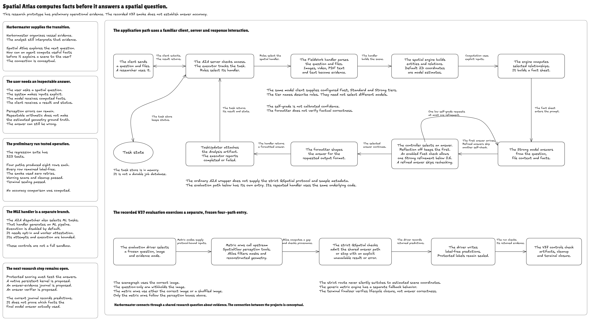
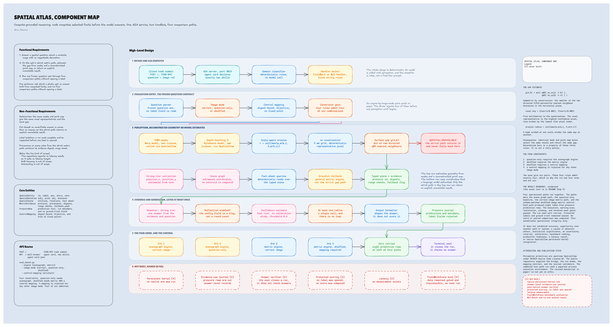

<h1 align="center">Spatial Atlas: A Compute-Grounded Spatial Reasoning Agent</h1>

<p align="center">
  <a href="https://github.com/arunshar/spatial-atlas-agent/actions/workflows/ci.yml"></a>
  <a href="LICENSE"></a>
  <a href="pyproject.toml"></a>
</p>

Spatial Atlas is an Agent2Agent (A2A) research agent built on compute-grounded reasoning, a design pattern in which code computes selected sub-problems from an explicit intermediate representation before a language model writes the answer. One server hosts a spatial question-answering handler and a machine-learning engineering (MLE) handler, and a separate benchmark driver offers four run modes, a strict metric bridge, and label-free journals. The only run-level evidence is one private label-free operational run, so this repository reports no accuracy, latency, or resource-use result.

## Links

| Resource | Link |
| --- | --- |
| Paper (PDF, v3) | <https://arunshar.com/projects/spatial-atlas-agent/static/paper/spatial_atlas.pdf> |
| Project page | <https://arunshar.com/projects/spatial-atlas-agent/> |
| Project showcase series | <https://arunshar.com/projects/showcase/> |
| This repository | <https://github.com/arunshar/spatial-atlas-agent> |

The same manuscript is in this repository as [paper/spatial_atlas.pdf](paper/spatial_atlas.pdf), with its LaTeX source in [paper/source/](paper/source/). It is not yet on arXiv, and [The paper](#the-paper) explains its status.

## Table of contents

- [Overview](#overview)
  - [Who this is for](#who-this-is-for)
  - [The workflow board](#the-workflow-board)
  - [The component map](#the-component-map)
  - [Two entry points](#two-entry-points)
- [How it works](#how-it-works)
  - [Step 1: A2A intake and dispatch](#step-1-a2a-intake-and-dispatch)
  - [Step 2: Perception and the metric engines](#step-2-perception-and-the-metric-engines)
  - [Step 3: The scene graph and the fact sheet](#step-3-the-scene-graph-and-the-fact-sheet)
  - [Step 4: Generation, one refinement, and the token ceiling](#step-4-generation-one-refinement-and-the-token-ceiling)
  - [Step 5: The four arms and the V37 operational check](#step-5-the-four-arms-and-the-v37-operational-check)
  - [Step 6: The MLE handler](#step-6-the-mle-handler)
  - [A proposed design that no code runs](#a-proposed-design-that-no-code-runs)
- [Quick start](#quick-start)
- [Configuration](#configuration)
- [Tests](#tests)
- [Docker](#docker)
- [Evaluation](#evaluation)
- [What is not built](#what-is-not-built)
- [Limitations](#limitations)
- [Project file structure](#project-file-structure)
- [The paper](#the-paper)
- [Citation](#citation)
- [License and attribution](#license-and-attribution)

## Overview

I built Spatial Atlas solo as an agent for compute-grounded spatial reasoning. It speaks the Agent2Agent (A2A) protocol, which carries tasks between agents as JSON-RPC over HTTP. A client can send a spatial question with images, video, PDFs, or text. The agent records the scene evidence in a typed structure called a scene graph, and ordinary code fills in missing distances and checks the extracted safety rules. A language model then writes the answer with those facts in its prompt.

I first built it for the AgentX-AgentBeats competition, which Berkeley's Center for Responsible, Decentralized Intelligence (RDI) runs. The competition sends two kinds of tasks. FieldWorkArena tasks ask spatial questions about factory, warehouse, and retail scenes. MLE-Bench tasks ask the agent to train a model for a Kaggle competition and write a submission file. The server has one handler for each kind, called the FieldWork handler and the MLE handler. Code execution in the MLE handler is disabled by default.

The default spatial engine does two-dimensional scene-graph arithmetic over positions that the Strong model tier estimates from text. The arithmetic repeats exactly for the same inputs, but the positions are model estimates, so the scene graph does not measure physical geometry. An opt-in metric engine builds geometry from segmentation masks and a reconstructed point map, and its strict horizontal-gap form runs only under the benchmark driver. The metric code calls NVIDIA's upstream SpatialClaw tools, and this repository does not include those tools. The only run-level evidence is one private, label-free smoke run called V37. A smoke run is a short run that checks whether each path executes and closes cleanly. V37 exercised the four paths that Step 5 defines, and it computed no score.

### Who this is for

- **Engineers** who want to run or extend the server should read [Quick start](#quick-start), [Step 1](#step-1-a2a-intake-and-dispatch), and [Configuration](#configuration). [docs/GUIDE.md](docs/GUIDE.md) gives the full setup.
- **Researchers** who care about the method should read [Steps 2 to 5](#step-2-perception-and-the-metric-engines) and [Evaluation](#evaluation). [docs/EXPLAINED.md](docs/EXPLAINED.md) and the [revised manuscript](paper/spatial_atlas.pdf) give the ideas and the full equations.
- **Reviewers** who want to check the claims should read this overview, [Evaluation](#evaluation), [What is not built](#what-is-not-built), and [Limitations](#limitations). Each claim in those sections points to code or to a stated limit.

### The workflow board

<p align="center">
  <a href="assets/diagrams/agent-workflow.png"></a>
</p>

This figure is the agent workflow board that I drew in Codex. Select the figure to open it at full size. The same board is also available as an [SVG file](assets/diagrams/agent-workflow.svg) and as its [Excalidraw source](assets/diagrams/src/agent-workflow.excalidraw). The board shows my working view of the project, and a few of its phrases are less precise than the text of this README. The panel titled "Harbormaster supplies the transition" describes a conceptual link to Harbormaster. Harbormaster is my separate research prototype for organizing vessel evidence, and this README makes no claim about its deployment or accuracy. This repository contains no Harbormaster code. The board's count of 323 tests comes from a local run of this repository's continuous integration (CI) test command at commit 26be11b, which the Evaluation section reports. When the board and this README differ, the README text is correct.

The board has two halves, and a column of five summary panels is on its left side. The panels cover the link to Harbormaster, the user's need for an inspectable answer, and the preliminary V37 run. They also cover the separate MLE handler and the next research step, which remains open.

The top half is the application path. A client sends a question, and the A2A server checks access. Fixed rules then pick a handler, and the FieldWork handler turns files into evidence. The spatial engine builds a scene and a fact sheet. The Strong tier writes the answer, and a controller allows at most one refinement. The formatter shapes the answer, and `TaskUpdater` attaches it as the `Analysis` artifact. The server names four model tiers (Fast, Standard, Strong, and Vision), and each tier maps to a configurable model. The board's note on tiers names only Fast, Standard, and Strong.

The bottom half is the separate evaluation entry that the V37 run exercised. It shares the FieldWork code but has its own driver, its own strict checks, and its own label-free journals. The last box in that row, "The V37 controls check artifacts, cleanup and terminal closure," shows the private V37 orchestration. This repository does not include that orchestration or its warning-scan, restoration, cleanup, and terminal-seal gates.

### The component map

<a href="assets/diagrams/component-map.png"></a>

Select the component map to open it at full size. The map is also available as an [SVG file](assets/diagrams/component-map.svg) and as its [Excalidraw source](assets/diagrams/src/component-map.excalidraw). As with the workflow board, when the map and this README differ, the README text is correct.

The component map splits the same system into six lanes. Lane 1 is A2A intake, and lane 2 is the frozen question contract for evaluation. Lane 2 describes the label-free strict QSpatial mode. For other SpatialClaw benchmarks, the driver can load labels and write a scored journal. Lane 3 is perception, and lane 4 is evidence and generation. Lane 5 holds the four comparison arms, and lane 6 names six parts I never built. Lane 1 serves the A2A path, and lanes 2 and 5 belong to the separate evaluation entry.

Boxes tagged `[X]` were never built. The "Latency" box in lane 6 means that no latency result exists. The evaluation driver still records the latency and token usage of each row. Two untagged boxes in lane 5 describe the private V37 run, and this repository has no code for them. The box "Zero retries" reports that run's output. The "Terminal seal" box is a V37 gate, and this repository does not include it. The lane 6 header reads "NOT BUILT, NAMED IN FULL." The full list in [What is not built](#what-is-not-built) has more items, including a sealed MLE-Bench result, a one-command orchestrator, a complete security sandbox for the MLE path, and a durable task store.

The left column lists the functional requirements, the non-functional requirements, the core entities, and the API routes. The right margin restates the gap formula from Step 2 and the four arm constraints from Step 5. It also gives a condensed form of the V37 result boundary, an attribution note, and the list of parts I never built. The exact boundary wording appears in Step 5.

The first functional requirement names an inspectable derivation. The A2A path returns only the formatted answer, so a client cannot see the scene graph or the fact sheet. `SpatialEntity`, `SpatialRelation`, and `SpatialScene` are classes in `src/fieldwork/spatial.py`. The `SpatialScene` class also holds zones, safety rules, and violations, and its `to_fact_sheet()` method writes the fact sheet. `MetricEvidence`, `PrescoreRow`, and `ControlMapping` are descriptive names for dictionary records and a mapping file, and no class carries those names.

### Two entry points

The repository has two entry points into the same FieldWork code.

| Entry point | Who calls it | What it runs |
| --- | --- | --- |
| `src/server.py` | An A2A client over HTTP | Admission control, bearer-token auth, rule dispatch, and both handlers |
| `eval_bench.py` | An operator on the command line | The FieldWork handler, called directly, with frozen run modes, strict metric checks, and label-free journals for strict QSpatial rows |

## How it works

This section follows one task through the system. Each step names the code that runs, states the rule it applies, and says what can go wrong. The equations come from the revised manuscript, and each one names its equation number there.

The four model tiers have fixed roles in the current code. The table below lists them. Each call site names its tier in code, and no component routes calls between tiers at run time.

| Tier | Default model | Current use |
| --- | --- | --- |
| Fast | `openai/gpt-4.1-mini` | The self-grade, and entity phrases for the generic metric engine |
| Standard | `openai/gpt-4.1` | MLE competition analysis |
| Strong | `openai/gpt-4.1` | Scene-graph extraction, spatial answers, refinement, code generation, and code repair |
| Vision | `openai/gpt-4.1` | Descriptions of images and video frames |

### Step 1: A2A intake and dispatch

A client sends a JSON-RPC task to the A2A server as `POST /`. Before the request reaches any model, the server applies three admission layers in a fixed order. A concurrency limit comes first, a bearer-token check comes second, and a body-size limit comes third. The A2A SDK then hands the message to the executor, which builds a fresh `Agent` for this one A2A execution. The Agent splits the message into text and files and picks a handler with four fixed string rules. No model call takes part in this choice. This is lane 1 of the component map. Lane 1 labels the request "question + image ref." The Agent reads only inline file bytes, and it ignores a file part that carries only a URI.

`src/agent.py` defines the dispatch rules.

```python
# src/agent.py, lines 183-198
        # Check for MLE-Bench tar file
        for name, mime, _data in file_parts:
            if name and ("competition" in name.lower() or name.endswith(".tar.gz")):
                return "mlebench"
            if mime and "gzip" in mime:
                return "mlebench"

        # Check for FieldWorkArena goal format
        text_lower = text.lower()
        if "# question" in text_lower and "# output format" in text_lower:
            return "fieldwork"

        # Check for MLE-Bench keywords
        mle_keywords = ["kaggle", "mle-bench", "competition", "submission.csv", "train a model"]
        if any(kw in text_lower for kw in mle_keywords):
            return "mlebench"
```

Every other task goes to the FieldWork handler. The FieldWork handler sends intermediate status updates through the SDK's task updater, and the agent card advertises streaming. The server does not support the A2A cancel operation.

#### What can go wrong and what I changed

A server on a public address with no token would accept any POST from anyone. Startup now stops when the server binds to a non-loopback address without a bearer token of at least 32 characters. A burst of requests could also start many model calls at once, so the server answers HTTP 503 when 4 non-read-only requests are already active. GET, HEAD, and OPTIONS requests never use a slot. The executor builds a fresh Agent for each execution, so each execution gets its own token ceiling. This holds even when a message references an earlier A2A task ID. Step 4 explains the ceiling. A failed task returns a sanitized message with a short reference code, and the client never sees exception text.

Section 2 of [docs/ARCHITECTURE.md](docs/ARCHITECTURE.md#2-the-a2a-request-path) traces every admission layer and status code.

### Step 2: Perception and the metric engines

The FieldWork handler parses the goal into a question, input data, and an output format. By default, it turns each file into text evidence. When the optional `torch` and `transformers` packages are installed, the Florence-2 detector runs first and supplies object counts, keyword-based protective-equipment flags, and a caption. The project does not declare those packages, so a default install skips this step. Florence-2 also computes bounding boxes, but the boxes never reach a model prompt.

The Vision tier then describes each image, and its prompt tells it to reuse the Florence-2 counts when they exist. Images in RGBA, LA, or palette mode are converted to RGB, every image is re-encoded as JPEG, and nothing is resized. The `pypdf` library extracts PDF text page by page, and the pipeline has no OCR step. OpenCV samples one video frame every two seconds, and it samples a long video more sparsely so that at most 30 frames remain. At most 10 evenly spaced frames are then described. Text files are decoded as UTF-8, and Latin-1 is the fixed fallback.

When an operator sets `ATLAS_FIELDWORK_ENGINE=metric`, the handler uses the metric code in `src/fieldwork/perception.py`. That code calls two perception tools through NVIDIA's SpatialClaw project. SAM 3 (Segment Anything Model 3) supplies object masks, and Depth Anything 3 supplies a point map with a confidence value for each point. SpatialClaw, its GPU tool server, and its tool wrappers belong to NVIDIA. Meta publishes SAM 3, and ByteDance publishes Depth Anything 3. The weights of each model carry their own license. This repository includes none of them.

#### The generic metric engine

On the A2A path, the metric setting always selects the generic metric engine, because the A2A server never passes the strict protocol identifier. The Fast tier lists up to six object phrases, and SAM 3 segments each phrase. For each object $i$, the engine keeps the mask points $Q_i$ whose coordinates are finite and whose confidence exceeds 0.3. It then computes a ground-plane position and a visible height, as Eq. 15 of the manuscript states.

```math
\begin{aligned}
\mathrm{pos}_i &= \bigl( \mathrm{med}_{p \in Q_i} X_x(p),\ \mathrm{med}_{p \in Q_i} X_z(p) \bigr),\\
h_i &= \mathrm{pct}_{97.5}\bigl(\lbrace X_y(p) \rbrace_{p \in Q_i}\bigr) - \mathrm{pct}_{2.5}\bigl(\lbrace X_y(p) \rbrace_{p \in Q_i}\bigr), \qquad \lvert Q_i \rvert \ge 32,\ h_i > 0.
\end{aligned}
```

The position is the median of the confident reconstructed points, and the engine stores its x and z coordinates as the entity position in the scene graph. A height needs at least 32 qualified points, and a height of zero or less is rejected. When the benchmark driver passes exact benchmark regions, the engine uses SpatialClaw's centroid rule and makes no Fast-tier call. When strict mode is off, which is the A2A default, a failure in the metric backend falls back to the scene-graph path of Step 3.

#### The strict horizontal-gap bridge

The benchmark driver in Step 5 can request a stricter protocol, `qspatial-horizontal-gap-v1`, and the A2A path never sends it. Its parser targets the horizontal-gap questions of Q-Spatial Bench, which the rest of this README calls QSpatial. Most of its constants belong to a frozen geometry contract, and the code serializes that contract and hashes it with SHA-256. Each candidate pair of object masks passes through the checks below, which Figure 2 of the manuscript draws. The strict path is the top row of lane 3 in the component map.

The bridge first resizes each mask to the $w_t \times h_t$ grid of the point map with nearest-neighbor sampling. It then erodes the resized mask $\tilde{M}$ once with a closed Euclidean disk (Eq. 7). Here $(w_m, h_m)$ is the original mask size, and an empty eroded mask makes the pair invalid.

```math
r_e = \left\lceil \max\left(\frac{w_m}{w_t}, \frac{h_m}{h_t}\right) \right\rceil, \qquad B_{r_e} = \lbrace (u, v) \in \mathbb{Z}^2 \mid u^2 + v^2 \le r_e^2 \rbrace, \qquad E = \tilde{M} \ominus B_{r_e}
```

Two eroded masks may still share pixels. The bridge measures their overlap with the overlap coefficient $\rho$ (Eq. 8). A pair with $\rho \ge 0.05$ is rejected, and a smaller overlap is removed from both masks.

```math
\rho(E_a, E_b) = \frac{\lvert E_a \cap E_b \rvert}{\min(\lvert E_a \rvert, \lvert E_b \rvert)}, \qquad
\begin{cases}
\text{reject the pair} & \text{if } \rho \ge 0.05,\\
E_k \leftarrow E_k \setminus (E_a \cap E_b) \text{ for } k \in \lbrace a, b \rbrace & \text{otherwise.}
\end{cases}
```

A pixel $p$ contributes only if its reconstructed point $X(p)$ has three finite coordinates and its confidence $c(p)$ is finite and above 0.3. The code treats world axes 0 and 2 as the horizontal plane, and it assumes a metric, gravity-aligned point map without checking either property. The bridge bins the qualified points into 5 mm voxels on the horizontal x-z plane, and each voxel keeps its highest-confidence point (Eqs. 9 and 10). A tie goes to the lowest flat pixel index.

```math
\begin{aligned}
Q(E) &= \lbrace p \in E \mid X(p) \text{ finite},\ c(p) \text{ finite},\ c(p) > 0.3 \rbrace,\\
\kappa(p) &= \left( \left\lfloor \frac{X_x(p)}{0.005} \right\rfloor, \left\lfloor \frac{X_z(p)}{0.005} \right\rfloor \right),\\
\pi(k) &= \mathop{\mathrm{arg\,max}}\limits_{p \in Q(E),\ \kappa(p) = k} \bigl( c(p),\ -\mathrm{idx}(p) \bigr).
\end{aligned}
```

A mask with more than 50,000 voxel keys keeps the 50,000 keys with the smallest SHA-256 digests, so the retained subset does not depend on sampling order (Eq. 11). Each mask must then keep at least 32 keys. For each representative of one object, the bridge finds its Euclidean nearest neighbor in the other object with a SciPy `cKDTree`. It summarizes each directed distance set by its fifth percentile with linear interpolation, and it takes the smaller of the two directed values as the gap $g$ (Eq. 12).

```math
\begin{aligned}
\mathrm{nn}_{A \to B}(\mathbf{u}) &= \min_{\mathbf{w} \in R_B} \lVert \mathbf{u} - \mathbf{w} \rVert_2 \quad (\mathbf{u} \in R_A),\\
g &= \min\Bigl( \mathrm{pct}_5\bigl(\lbrace \mathrm{nn}_{A \to B}(\mathbf{u}) \rbrace_{\mathbf{u} \in R_A}\bigr),\ \mathrm{pct}_5\bigl(\lbrace \mathrm{nn}_{B \to A}(\mathbf{w}) \rbrace_{\mathbf{w} \in R_B}\bigr) \Bigr),\\
0 &< g \le 20\ \text{m}.
\end{aligned}
```

Here $R_A$ and $R_B$ hold the x-z coordinates of the voxel representatives of objects A and B. A gap that is not finite or lies outside $(0, 20]$ m makes the pair invalid. At the 32-voxel minimum, the fifth percentile falls between the second and third smallest distances, so the single smallest distance in each direction does not set the gap. The symmetric minimum removes any dependence on which object is named first. The gap estimator is Atlas code.

```python
# src/fieldwork/perception.py, lines 423-429
    tree_a = cKDTree(voxel_points[0])
    tree_b = cKDTree(voxel_points[1])
    distances_a_to_b = tree_b.query(voxel_points[0], k=1, workers=1)[0]
    distances_b_to_a = tree_a.query(voxel_points[1], k=1, workers=1)[0]
    directed_a_to_b = float(np.quantile(distances_a_to_b, 0.05, method="linear"))
    directed_b_to_a = float(np.quantile(distances_b_to_a, 0.05, method="linear"))
    gap_m = min(directed_a_to_b, directed_b_to_a)
```

A distinct-pair question names two different objects, and every cross pair of their instances is a candidate. A repeated-instance question asks about two instances of the same object. For such a question, an instance enters pairing only if its raw mask area is at least 0.30 of the largest instance area, and at least two instances must remain. The bridge selects the valid pair with the smallest gap and breaks ties by the lowest mask indices (Eq. 13).

```math
\mathcal{I} = \lbrace i \mid \max_j \mathrm{area}_j > 0,\ \mathrm{area}_i \ge 0.30 \max_j \mathrm{area}_j \rbrace, \qquad
(i^{\ast}, j^{\ast}) = \mathop{\mathrm{arg\,min}}\limits_{(i, j)\ \text{valid}} \bigl( g_{ij},\ (i, j) \bigr)
```

The bridge has three outcomes (Eq. 14). The evidence checks are an unsupported question, an empty segmentation, fewer than two plausible instances, and the absence of any valid pair. When one of them fails, the handler returns the literal answer `measurement unavailable` before the reasoner runs.

```math
B =
\begin{cases}
g_{i^{\ast} j^{\ast}} \text{ in meters, in the fact sheet} & \text{if a valid pair exists},\\
\text{the literal answer measurement unavailable} & \text{if an evidence check fails},\\
\text{an error} & \text{if parsing, the manifest check, or a service fails.}
\end{cases}
```

The fact sheet prints a valid gap to six decimals. The Strong tier then writes the final answer from that fact sheet and may refine it once, so the gap reaches the answer only through the model. No code checks that the final answer repeats $g$.

#### What can go wrong and what I changed

The metric output is an estimate, because mask, depth, scale, and occlusion errors can reach the fact sheet. A wrong mask or a wrong scale that passes every check still produces a wrong gap. The strict parser was written against Q-Spatial Bench question text. It carries hand-written aliases, marks three rows as unsupported, and uses a separate table that rewrites some grounding queries sent to SAM 3. That table and the 0.30 instance-area ratio sit outside the hashed contract, and I chose the 0.30 ratio by inspecting development cases. The parser is therefore fitted to this benchmark.

NVIDIA's public SpatialClaw finds its GPU server through the registry file `logs/gpu_server.json`. When that file lists no live server, SpatialClaw polls 1,440 times at ten-second intervals, which is about four hours. A laptop with the package installed but no GPU server can therefore hang silently. My local SpatialClaw checkout adds a `SPATIALCLAW_GPU_SERVER_URL` override that pins one server address, so a call to an unreachable address fails within seconds. NVIDIA's public release does not read this variable, so the loopback default below shortens the wait only with that local change.

```python
# src/fieldwork/perception.py, lines 806-811
        os.environ.setdefault("SPATIALCLAW_GPU_SERVER_URL", "http://127.0.0.1:1")

        # Imported lazily: only available where the SpatialClaw package is installed
        # (a GPU agent environment), so the API service stays importable without it.
        from spatial_agent.tools.reconstruct_tool import ReconstructTool
        from spatial_agent.tools.sam3_tool import SAM3Tool
```

### Step 3: The scene graph and the fact sheet

The default engine asks the Strong tier to turn the first 8,000 characters of the file descriptions into JSON. The JSON lists entities, relations, zones, and safety rules, and each entity may carry `position_x` and `position_y`. The Strong tier estimates these positions from text descriptions of the image, so they are estimates and not measurements. The entities and relations form a scene graph $G = (V, E)$, in which each vertex is a `SpatialEntity` and each edge is a `SpatialRelation` (Eqs. 2 and 3). The object of a relation can also name a zone, so an edge need not join two entities.

Code in `src/fieldwork/spatial.py` then runs deterministic operations over the graph. It keeps every distance that the extraction supplied, and it computes the Euclidean distance only for a relation that has none (Eq. 4). It rounds a computed distance to two decimals.

```math
d_{ij} =
\begin{cases}
\hat{d}_{ij} & \text{if the extraction supplies a distance},\\
\mathrm{round}_2\bigl(\lVert \mathrm{pos}_i - \mathrm{pos}_j \rVert_2\bigr) & \text{if both positions exist},\\
\text{undefined} & \text{otherwise.}
\end{cases}
```

```python
# src/fieldwork/spatial.py, lines 66-82
    def compute_distance(self, id_a: str, id_b: str) -> float | None:
        """Compute Euclidean distance between two entities."""
        a = self.entities.get(id_a)
        b = self.entities.get(id_b)
        if not a or not b or not a.position or not b.position:
            return None
        dx = a.position[0] - b.position[0]
        dy = a.position[1] - b.position[1]
        return math.sqrt(dx * dx + dy * dy)

    def compute_all_distances(self) -> None:
        """Compute distances for all relations that don't have one."""
        for rel in self.relations:
            if rel.distance is None:
                dist = self.compute_distance(rel.subject, rel.object)
                if dist is not None:
                    rel.distance = round(dist, 2)
```

The pipeline then calls `check_constraints()`, which takes no argument and reads the safety rules that the Strong tier extracted. It flags a worker whose extracted attributes mark missing protective equipment. It also flags a person-to-hazard relation whose distance falls below a threshold parsed from a rule (Eq. 6).

```math
\mathrm{viol}(e_{ij}) = [\ell_i \in \mathcal{P}] \wedge [\ell_j \in \mathcal{H}] \wedge [d_{ij} < r_{\text{rule}}]
```

Here $\ell_i$ is the lowercased label of entity $i$, and each bracket is 1 when its condition holds. The person set $\mathcal{P}$ holds worker, person, and employee. The hazard set $\mathcal{H}$ holds forklift, machinery, crane, conveyor, and vehicle. The threshold $r_{\text{rule}}$ is the first number followed by the letter m in a rule whose text contains "distance", "meters", or "from". Finally, `to_fact_sheet()` writes a text summary for the answer prompt. It prints a horizontal-gap distance with six decimals and any other distance with one decimal. The graph also defines `query_near`, and only unit tests call it.

The first three boxes in the bottom row of lane 3 show this engine. The last two boxes, "Graceful fallback" and "Typed scene + evidence," describe the metric engines. The default scene graph carries no protocol id, digests, or range checks.

#### What can go wrong and what I changed

Correct arithmetic cannot repair a wrong position, so an estimation error carries into every fact derived from it. The fact sheet mixes model-estimated positions, model-supplied distances, and code-computed distances, and the scene does not record which distances the code computed. A missing hard-hat or vest attribute counts as compliant, so missing evidence can hide a violation. When extraction returns invalid JSON, the engine returns an empty scene and the prompt carries no fact sheet. I have not fixed these limits in code. I changed the claims to match them, so the docs and the paper describe these values as model-estimated positions.

Section 5 of [docs/EXPLAINED.md](docs/EXPLAINED.md#5-the-fieldwork-path) states what the graph establishes and what it does not.

### Step 4: Generation, one refinement, and the token ceiling

The reasoner builds one prompt from the question, the first 12,000 characters of the file descriptions, the fact sheet, and the output format. The Strong tier writes the first answer. The Fast tier then grades that answer with a self-reported number, and it sees the question, the answer, and only the first 2,000 characters of the descriptions. When the grade is below 0.6, the Strong tier writes one refinement, and no second refinement follows. The formatter finally shapes the answer to the requested format, such as JSON, a number, or yes or no. The Agent returns the result as an artifact named `Analysis`. Eqs. 18 to 20 of the manuscript state the controller.

```math
\begin{aligned}
a_0 &= \mathrm{Strong}\bigl(q,\ D_{:12000},\ F\bigr),\\
\sigma &=
\begin{cases}
\mathrm{parse}\bigl(\mathrm{Fast}(q,\ D_{:2000},\ a_0)\bigr) & \text{if the reply parses},\\
0.5 & \text{otherwise},
\end{cases}\\
a &=
\begin{cases}
\mathrm{Strong}\bigl(q,\ a_0,\ D_{:6000},\ F\bigr) & \text{if } n_{\text{refl}} > 0 \text{ and } \sigma < 0.6,\\
a_0 & \text{otherwise.}
\end{cases}
\end{aligned}
```

Here $D_{:n}$ is the first $n$ characters of the file descriptions, and $F$ is the fact sheet. The reflection setting $n_{\text{refl}}$ defaults to 2, and the code reads it only as greater than zero, so it acts as an on-off flag. This is lane 4 of the component map. The last box in lane 4, the prescore journal, belongs to the evaluation entry. The map does not draw the `Analysis` artifact that the A2A path returns.

```python
# src/fieldwork/reasoner.py, lines 95-108
        # Entropy-guided confidence check: refine if low confidence
        if self.config.max_reflection_rounds > 0:
            confidence = await self.entropy.estimate_confidence(
                answer=answer,
                evidence=evidence[:2000],
                query=query,
            )
            logger.info(f"Answer confidence: {confidence:.2f}")

            if confidence < 0.6:
                logger.info("Low confidence: reflecting and refining answer")
                answer = await self._refine_answer(
                    query, answer, evidence[:6000], spatial_section, output_format
                )
```

The code comment still says entropy-guided. The call is one self-grade from the Fast tier, and no entropy calculation runs.

Every model call on the public A2A path goes through `BudgetedLLMClient`, which enforces a heuristic per-execution ceiling of 150,000 tokens. That figure is a configured cap, and this repository reports no observed token usage. Before each call, the client estimates the prompt size and reserves that estimate plus the allowed maximum completion under a lock (Eq. 1).

```math
\begin{aligned}
m' &= \min\bigl(m,\ L - U - \mathcal{R} - \hat{p}\bigr), \qquad \text{refuse the call if } m' \le 0,\\
\mathcal{R} &\leftarrow \mathcal{R} + \hat{p} + m' \quad \text{otherwise}.
\end{aligned}
```

Here $L$ is the 150,000-token ceiling, $U$ is the committed total, $\mathcal{R}$ is the outstanding reservation, $m$ is the requested completion limit, and $\hat{p}$ is the prompt estimate. When $m' \le 0$, the client raises `TokenBudgetExceeded` before the call reaches the provider. After the call, the client commits the whole reservation, whatever the provider later reports.

```python
# src/budgeted_llm.py, lines 51-61
    async def _reserve(self, prompt_tokens: int, max_tokens: int) -> tuple[int, int]:
        if max_tokens <= 0:
            raise ValueError("max_tokens must be positive")
        async with self._budget_lock:
            remaining = self._budget_limit - self._budget_spent - self._budget_reserved
            completion_tokens = min(max_tokens, remaining - prompt_tokens)
            if completion_tokens <= 0:
                raise TokenBudgetExceeded("Task token budget is exhausted")
            reservation = prompt_tokens + completion_tokens
            self._budget_reserved += reservation
            return completion_tokens, reservation
```

A text part counts as $\max(1, \lceil \mathrm{len}/4 \rceil)$ tokens. An inline image string counts as 2,048 tokens, and an image sent to the vision call counts as one token per kilobyte, bounded between 1,024 and 8,192. The lock makes the counter concurrency-safe, so parallel calls within one A2A execution cannot oversubscribe it. The estimate is not exact tokenizer accounting, and provider-reported usage is not treated as an exact tokenizer count either.

#### What can go wrong and what I changed

An earlier write-up described an expected-information-gain policy that chose among reasoning actions. The request path never calls that selector, which is still defined in `src/entropy/engine.py`. The repository also defines a tier-router class in `src/cost/router.py`, and no code calls it either. The docs now describe the controller that runs. When the grading reply cannot be parsed, the grade defaults to 0.5, so a refinement runs. The code does not clip the parsed grade to the range from 0.0 to 1.0. The grade is a gating heuristic, and no study in this repository shows that it is calibrated. The refinement sees a shorter slice of the same descriptions, so it adds no new evidence. The formatter also does not verify that the answer is correct.

### Step 5: The four arms and the V37 operational check

`eval_bench.py` loads a benchmark through the benchmark factory in a SpatialClaw checkout, and it calls the FieldWork handler directly on each row. Its strict metric checks target the QSpatial++ split of Q-Spatial Bench. These questions ask for the horizontal gap between two objects. Two options select a path. The engine option is `scenegraph` or `metric`, and the image-mode option is `correct`, `question-only`, or `shuffled`. The driver enforces four constraints, so only four of the six combinations run (Eq. 16).

```math
\mathcal{M} = \bigl\lbrace (\text{scenegraph}, \text{correct}),\ (\text{scenegraph}, \text{question-only}),\ (\text{metric}, \text{correct}),\ (\text{metric}, \text{shuffled}) \bigr\rbrace
```

Each admitted mode is one arm of a comparison design. The scene-graph path sends the question with its own image. The question-only baseline withholds the image. The correct-image metric path sends the question and its own image through the strict metric bridge. The schema-matched shuffled-image metric control sends the image that a frozen control mapping assigns, and no source path in that mapping maps to itself. The driver turns on strict mode whenever the metric engine is selected. This step covers lanes 2 and 5 of the component map.

```python
# eval_bench.py, lines 211-218
    if args.image_mode == "question-only" and args.engine != "scenegraph":
        parser.error("--image-mode question-only requires --engine scenegraph")
    if args.image_mode == "shuffled" and args.engine != "metric":
        parser.error("--image-mode shuffled requires --engine metric")
    if args.image_mode == "shuffled" and not args.control_mapping:
        parser.error("--image-mode shuffled requires --control-mapping")
    if args.image_mode != "shuffled" and args.control_mapping:
        parser.error("--control-mapping is valid only with --image-mode shuffled")
```

The shuffled-image control is bound to a contract (Eq. 17). The control mapping $\phi$ is defined over the set $S$ of source image paths, and $\delta_s$ is the recorded SHA-256 digest of the image stored at path $s$. The loader checks the size of the mapping, its bijectivity, the absence of fixed points, and the digest of every source and control image. The mapping metadata must also name a fixed cyclic-next algorithm over byte-sorted paths.

```math
\begin{aligned}
&\phi : S \to S, \qquad \lvert S \rvert = 84, \qquad \phi \text{ is a bijection}, \qquad \phi(s) \ne s \ \ \forall s \in S,\\
&\mathrm{SHA256}(s) = \delta_s \ \text{ and } \ \mathrm{SHA256}\bigl(\phi(s)\bigr) = \delta_{\phi(s)} \ \ \forall s \in S.
\end{aligned}
```

```python
# eval_bench.py, lines 345-353
        if record["source_path"] in lookup:
            raise ValueError("QSpatial control mapping repeats a source image")
        if record["source_path"] == record["control_path"]:
            raise ValueError("QSpatial control mapping contains a fixed point")
        lookup[record["source_path"]] = record
    if len(lookup) != QSPATIAL_CONTROL_IMAGE_COUNT:
        raise ValueError("QSpatial control mapping source count drifted")
    if set(lookup) != {record["control_path"] for record in lookup.values()}:
        raise ValueError("QSpatial control mapping is not a bijection")
```

The loader compares paths, and it never compares a source digest with its control digest. It would therefore admit two byte-identical images stored under different paths.

The driver writes label-free journals under the `label_free_prescore_v1` schema for the strict QSpatial horizontal-gap rows. Prescore means the driver writes these rows before any scoring step. Rows are appended with an append-only file flag. The writer rejects any payload that contains a label-shaped key such as `gt`, `answer`, `score`, or `label`, and it uses an exact-key list plus token and prefix rules to find them. Prediction metadata must contain exactly six safe fields. The writer also refuses to mix label-free and ordinary rows in one journal, and it refuses to resume a journal whose schema does not match the current run. The journals record predictions and run metadata. They do not record which evidence an answer used.

#### What can go wrong and what I changed

On the A2A path, the generic metric engine has a documented fallback to the scene graph when the backend fails. Inside an evaluation, that fallback would let a metric arm silently answer from estimated positions, and the arms would stop being distinct. The strict metric bridge returns an explicit unavailable result, and it never falls back silently. A service error or a failed validation raises an error, and the driver records it in the journal row. The command line also rejects arm combinations that the design does not allow.

```python
# src/fieldwork/handler.py, lines 150-156
                    if scene is None:
                        logger.info(
                            "QSpatial metric grounding unavailable: %s",
                            evidence["geometry"]["invalid_reason"],
                        )
                        return QSPATIAL_UNAVAILABLE
                    validate_qspatial_gap_scene(scene, evidence)
```

`QSPATIAL_UNAVAILABLE` is the literal answer `measurement unavailable`. The handler returns it before the reasoner runs.

#### The V37 run

I ran the four arms once in a private execution environment, and that run is called V37. The public repository alone cannot reproduce V37. Every arm needs a SpatialClaw checkout and the benchmark data, because the driver loads questions and images through SpatialClaw's benchmark factory. The metric arms need a GPU tool server and private control artifacts as well. The strict QSpatial arms need a `qspatial_gap` benchmark loader that I wrote inside a local SpatialClaw checkout. NVIDIA's public SpatialClaw does not include this loader. The loader extends SpatialClaw's benchmark classes, so it falls under NVIDIA's Source Code License-NC. This repository does not include the loader for that reason. The private orchestration that ran the four arms together is not in this repository either.

The boundary below comes from the project's evidence record, which was written as guidance for anyone who describes the run. It opens with an instruction to the writer. I copied it word for word with one change, and the manuscript's Table 3 makes the same change. Item 9 of the second list says "resource-use" in place of the record's own term.

> The new Spatial Atlas result is a label-free operational validation. Use this wording and no stronger interpretation:
>
> 1. Four operational paths ran together.
> 2. The paths were the scene-graph path, question-only baseline, correct-image metric path, and schema-matched shuffled-image metric control.
> 3. Each path produced eight label-free prescore prediction rows.
> 4. The total was 32 rows.
> 5. The execution, warning-scan, restoration, cleanup, and terminal-seal gates passed.
> 6. The run used zero retries.
> 7. Protected labels and ground truth remained sealed.
> 8. No score or paired comparison was computed.
> 9. This establishes operational integrity only.
>
> It does not establish:
>
> 1. Accuracy.
> 2. Superiority over another path or system.
> 3. A causal or ablation effect.
> 4. Statistical significance.
> 5. An uncertainty interval.
> 6. Calibration.
> 7. Benchmark ranking.
> 8. Production readiness.
> 9. A resource-use or latency result.
> 10. Native SpatialClaw persistent-kernel integration.
>
> The local regression suite reported 350 tests plus 63 subtests in the dated V37 record. Treat that as `LOCAL_REGRESSION_PASS`, not benchmark accuracy.
>
> Prediction journals are not answer-level evidence-use journals. The terminal finalizer is not an answer verifier. The V37 metric arm used SpatialClaw perception primitives through the Atlas bridge, but V37 did not run a native SpatialClaw persistent-kernel arm.

In that record, `LOCAL_REGRESSION_PASS` is the evidence class for a local test suite that passed against a frozen control. The run used one submission with zero retries and no rollback, and every bounded execution step exited cleanly. The record says that all eight bounded logs passed the required warning scan. It describes the restoration gate as a registry restoration and the cleanup gate as a check that a job-local authentication artifact was absent after teardown. The terminal finalizer ran exactly once. The terminal-seal gate and the terminal finalizer wrote a closed final record of the run, and neither one checked an answer.

The V37 record does not restate the control mapping that the private run loaded, so this README does not report its size. Whether the strict geometry step in the V37 shuffled arm measured the control image or the source image depends on the private benchmark loader. The public code does not settle that question, so the manuscript treats the shuffled arm as an executed control path and does not treat it as a geometry control. Its score and its paired effect against the correct-image path remain unknown, because the protected labels stayed sealed.

### Step 6: The MLE handler

The MLE handler turns a competition task into one generated pipeline script. The Standard tier reads the competition description, a file listing, and a data preview. It returns JSON with a task type, a metric and its direction, a target column, the submission format, a short data summary, a strategy name, and key insights. The strategy name selects one of the templates below, which the handler inserts into the code-generation prompt. The Strong tier writes the final script, so a template guides the code and is not the code that runs.

| Strategy name | Task type | Template contents |
| --- | --- | --- |
| `tabular` | Tabular classification or regression | AutoGluon `TabularPredictor` with a 300-second limit, which falls back to LightGBM when AutoGluon is not installed |
| `nlp` | Text classification | TF-IDF unigram and bigram features (up to 50,000) with logistic regression and a cross-validation check |
| `vision` | Image classification | Flattened 32 by 32 pixel features with a tree-ensemble classifier |
| `timeseries` | Forecasting | Lag features (1, 7, 14, and 28 steps), rolling features, and a LightGBM regressor |
| `general` | Mixed or unknown | A gradient-boosting classifier or regressor |

The generated script loads the data, implements the strategy, holds out a simple validation split, and prints one `VALIDATION_SCORE` line for that split. It then writes `submission.csv` in the required format. Execution is fail-closed, and the handler refuses to run code unless an operator sets two flags.

```python
# src/mlebench/handler.py, lines 112-119
        if not _enabled("ATLAS_ENABLE_MLEBENCH_CODE_EXECUTION") or not _enabled(
            "ATLAS_TRUSTED_ISOLATED_WORKER"
        ):
            raise PermissionError(
                "MLE-Bench code execution is disabled. An isolated worker must set both "
                "ATLAS_ENABLE_MLEBENCH_CODE_EXECUTION=true and "
                "ATLAS_TRUSTED_ISOLATED_WORKER=true."
            )
```

The second flag is an operator's attestation that the process runs in an isolated, trusted worker, and the code cannot confirm that isolation. After authorization, each generated pipeline runs in a subprocess with a 600-second timeout and a minimal environment. When a run fails, the Strong tier receives the script, the last 2,000 characters of the error, the last 1,000 characters of stdout, and the competition description, and it returns a revised script. The initial run and its repairs make at most 3 total attempts. When every attempt fails, the task fails, unless dummy submissions were separately enabled.

After the first successful run, the handler parses the last `VALIDATION_SCORE` match in the script's standard output. It skips refinement when the first run prints no score. Otherwise it asks the Strong tier for a revision, runs it under the same controls, and keeps it only when the parsed score is better under the metric direction (Eq. 23).

```math
\begin{aligned}
n_{\text{attempt}} &\le 3, \qquad n_{\text{refine}} \le 2, \qquad t_{\text{run}} \le 600\ \text{s},\\
\text{accept } \nu' &\iff
\begin{cases}
\nu' < \nu & \text{if the direction text contains a minimize keyword},\\
\nu' > \nu & \text{otherwise.}
\end{cases}
\end{aligned}
```

Here $\nu$ is the best parsed score so far, and $\nu'$ is the revised score. The minimize keywords are min, lower, loss, error, rmse, mae, and mse. The loop runs at most 2 extra passes. It starts no new pass once 900 seconds have passed since the first successful run, and a pass that started before that point can finish after it.

Every code-generation call also receives a leak audit preamble. It asks the model to check ID overlap between train and test, duplicated row fingerprints, temporal ordering, and identical media files. The audit text also tells the model to use the train labels for matching rows when more than 50% of rows overlap. A hint registry adds a targeted hint for its one registered competition, Random Acts of Pizza. The detection rate of this audit has not been measured. The MLE path does not call the entropy module.

#### What can go wrong and what I changed

The pipeline prints its own validation score, so that score is a self-reported proxy that no outside check verifies. These execution controls reduce risk, but the subprocess is not a complete security sandbox. The subprocess runs as a process group, which the handler terminates on timeout or when it cancels the run internally. No sealed end-to-end MLE-Bench result exists, and Section 4 of [docs/ARCHITECTURE.md](docs/ARCHITECTURE.md#4-the-mle-handler) describes the handler further.

### A proposed design that no code runs

The manuscript also states an entropy-guided design, and it labels that design as a proposal. No code in the repository computes Eq. 21 or runs the selection rule in Eq. 22. At each reasoning step $t$, an agent under this design would keep a knowledge state $\mathcal{K}_t$ and measure its uncertainty over the candidate answers $\mathcal{A}$.

```math
H(\mathcal{A} \mid \mathcal{K}_t) = -\sum_{y \in \mathcal{A}} P(y \mid \mathcal{K}_t) \log P(y \mid \mathcal{K}_t)
```

It would then pick the candidate action $c_j$ with the largest expected information gain, where $o$ is the observation that the action would return.

```math
c^{\ast} = \arg\max_{c_j} \ \mathbb{E}_{o \sim P(o \mid \mathcal{K}_t, c_j)} \bigl[ H(\mathcal{A} \mid \mathcal{K}_t) - H(\mathcal{A} \mid \mathcal{K}_t \cup \lbrace o \rbrace) \bigr]
```

The repository defines a selector for Eq. 22, which would ask the Fast tier to rate each candidate action from 1 to 10. No code calls it. A graded routing policy across the tiers is also a design target, and the tier router in `src/cost/router.py` is never called. No result in this repository shows the effect of either design on answers or on resource use.

## Quick start

You need [`uv`](https://docs.astral.sh/uv/). It reads `.python-version` and uses Python 3.13, which it downloads when needed. `pyproject.toml` also allows Python 3.12, and you can select it by adding `--python 3.12` to the `uv sync` and `uv run` commands.

```bash
git clone https://github.com/arunshar/spatial-atlas-agent.git
cd spatial-atlas-agent
uv sync --frozen --extra test
uv run pytest -m "not e2e and not gpu"
```

The tests need no API key, GPU, or SpatialClaw. Every test command in this README assumes that you already ran `uv sync --frozen --extra test`.

Add a model key and bind to loopback to start the server on your own machine.

```bash
cp sample.env .env            # then replace sk-... with your OpenAI API key
uv run src/server.py --host 127.0.0.1 --port 9019
```

The server keeps running in this terminal. Open a second terminal to fetch the agent card, and press Ctrl+C in the first terminal to stop the server.

```bash
curl -s http://127.0.0.1:9019/.well-known/agent-card.json
```

Run `uv run python eval_smoke.py` to send one synthetic task to the local server. The client exits with code 1 when the task ends in any state other than completed. When the task fails, the client prints a short reference code. Search the server's terminal output for that code to see the exception type. A missing or invalid model key is one common cause. The smoke client sends no bearer token, so use it only against a loopback server that has no token set. [docs/GUIDE.md](docs/GUIDE.md) covers the metric engine, the evaluation entry, and troubleshooting.

## Configuration

These environment variables control the public A2A server. `sample.env` holds placeholders for the model key and the bearer token.

| Variable | Default | Effect |
| --- | --- | --- |
| `OPENAI_API_KEY` | Unset | It supplies the key for the default model tiers, which call OpenAI models through LiteLLM. LiteLLM is a library that calls many model providers through one interface. |
| `ATLAS_FAST_MODEL`, `ATLAS_STANDARD_MODEL`, `ATLAS_STRONG_MODEL`, `ATLAS_VISION_MODEL` | `openai/gpt-4.1-mini` for Fast, `openai/gpt-4.1` for the rest | Each value needs a provider prefix, and startup stops without one. [docs/GUIDE.md](docs/GUIDE.md#3-add-a-model-key) lists what each tier does. |
| `ATLAS_BEARER_TOKEN` | Unset | Requests other than GET, HEAD, and OPTIONS must send it. It must have at least 32 characters. |
| `ATLAS_MAX_REQUEST_BYTES` | 64 MiB | The server answers 413 for a larger body. |
| `ATLAS_MAX_CONCURRENT_REQUESTS` | 4 | The server answers 503 when this many non-read-only requests are already active. |
| `ATLAS_ENABLE_MLEBENCH_CODE_EXECUTION` | Disabled | This flag allows generated-code execution in the MLE handler. |
| `ATLAS_TRUSTED_ISOLATED_WORKER` | Disabled | This flag attests that the process runs in an isolated, trusted worker. |
| `ATLAS_ALLOW_DUMMY_SUBMISSION` | Disabled | This flag allows a placeholder submission after every real attempt fails. |
| `ATLAS_ALLOW_UNAUTHENTICATED_PUBLIC` | Disabled | This test-only override lets a non-loopback server start without a token. Never use it for a deployment. |
| `ATLAS_FIELDWORK_ENGINE` | `scenegraph` | Setting `metric` turns on the generic metric engine from Step 2. |
| `PUBLIC_URL` | Unset | The agent card advertises this URL. Without it, the card uses the `SPACE_HOST` address on a Hugging Face Space before it falls back to the bind address, such as `http://0.0.0.0:9019/`. The `--card-url` flag overrides all three. |

A normal non-loopback bind always requires the bearer token, even when code execution is disabled. Only loopback development may omit it.

The MLE handler is a separate branch, and its code execution is off by default. Execution needs both `ATLAS_ENABLE_MLEBENCH_CODE_EXECUTION=true` and `ATLAS_TRUSTED_ISOLATED_WORKER=true`, and startup then also requires the bearer token. When execution is enabled, each generated pipeline runs in a subprocess with a 600-second timeout and a minimal environment. The handler makes at most 3 total attempts, and it repairs the code from the captured error between attempts. When every attempt fails, the task fails, unless dummy submissions were separately enabled. Step 6 describes the refinement loop and its limits.

The frozen benchmark driver in `eval_bench.py` uses the base `LLMClient`, which only records usage. The driver applies no per-execution reservation, and it writes each row's usage counts into the journal artifacts.

## Tests

The tests run on your machine with no API key, GPU, SpatialClaw checkout, or dataset. The CI workflow in `.github/workflows/ci.yml` runs this command after a lint step and a security scan.

```bash
uv run pytest -m "not e2e and not gpu" --cov=fieldwork.perception --cov-report=term-missing --cov-fail-under=90
```

The `pytest` options in `pyproject.toml` already deselect the `e2e` and `gpu` markers, so a plain `uv run pytest` runs the same set. The end-to-end test needs a GPU tool server and the dataset, and it stays deselected in CI. The perception tests use in-memory fakes, so they run without SpatialClaw or a GPU. These commands run the tests for each step.

```bash
uv run pytest tests/test_agent.py tests/test_request_size_middleware.py tests/test_task_failure_lifecycle.py   # Step 1
uv run pytest tests/test_perception.py tests/test_perception_contract.py tests/test_perception_property.py      # Step 2
uv run pytest tests/test_spatial_comprehensive.py                                                               # Step 3
uv run pytest tests/test_handler_engine.py tests/test_llm_budget_enforcement.py                                 # Step 4
uv run pytest tests/test_eval_bench.py                                                                          # Step 5
uv run pytest tests/test_mlebench_executor_security.py tests/test_mlebench_leak_registry.py                     # Step 6
```

Passing tests establish only the software behavior they exercise. They are not benchmark evidence.

## Docker

The Dockerfile starts the server with `--host 0.0.0.0`, which is a non-loopback address. The container therefore needs `ATLAS_BEARER_TOKEN` in `.env`, and the token must have at least 32 characters. Startup stops without it.

```bash
python3 -c "import secrets; print(secrets.token_urlsafe(32))"   # put the output in .env as ATLAS_BEARER_TOKEN
docker build -t spatial-atlas-agent .
docker run --rm -p 9019:9019 --env-file .env -e PUBLIC_URL=http://127.0.0.1:9019/ spatial-atlas-agent --host 0.0.0.0 --port 9019
```

The server answers read-only requests without the token, so anyone can fetch the agent card.

```bash
curl -s http://127.0.0.1:9019/.well-known/agent-card.json
```

Every POST must carry the header `Authorization: Bearer <ATLAS_BEARER_TOKEN>`, and the server answers 401 without it. The image holds `src/`, the project metadata, the LICENSE and NOTICE files, the license texts in `LICENSES/`, and the locked runtime dependencies. It does not include the tests, the evaluation entry, or SpatialClaw.

## Evaluation

This table lists every test or run result that this repository reports. The Scope column matches the evidence scope that the manuscript gives each number.

| What | Result | Scope | Source |
| --- | --- | --- | --- |
| Frozen V37 control suite | Passed 350 tests plus 63 subtests | Private evidence, a local regression pass | A private V37 record that this repository does not include. The suite checks software behavior against a frozen control. |
| V37 four-arm smoke run | 4 arms, 8 label-free rows per arm, 32 rows total, zero retries | Private evidence, a label-free smoke run with no score | One private run that the public repository cannot reproduce. |
| CI test command of this repository | 323 passed, 1 deselected | Local run of the public repository's CI command at commit 26be11b with Python 3.13 | The deselected case is the end-to-end test marked `e2e`, which needs a GPU tool server and the dataset. |
| Line coverage of `src/fieldwork/perception.py` | 92.09% | Public repository CI gate at commit 26be11b, one module only | The same CI command reports it, and CI fails below 90%. |

These numbers have limits, and none of them measures answer quality. The 350 tests and 63 subtests show that the frozen control code behaves as its tests expect. The manuscript reports the count of 323 for the test suite at commit 26be11b, and a later version of the suite can report a different count. The two test counts come from different suites, so they should not be compared. The V37 smoke run shows that four paths ran and closed cleanly with labels sealed. It gives no accuracy, superiority, causal, significance, calibration, ranking, production-readiness, resource-use, or latency result.

This repository reports no FieldWorkArena result, because the benchmark data stayed gated and inaccessible. It reports no MLE-Bench result either, because no sealed end-to-end run artifact exists. The next scientific phase is protected scoring, paired analysis, and uncertainty analysis, and none of it has been performed. Section 9 of the manuscript specifies that protocol in advance. Under it, the analysis plan will be frozen before any label is unsealed, and each paired comparison will carry an uncertainty interval.

An earlier version of the paper is on arXiv as [2604.12102v2](https://arxiv.org/abs/2604.12102v2). That version reported values that the current repository cannot tie to sealed run artifacts. The revised manuscript in [`paper/`](paper/) removes them, and it is not yet on arXiv.

## What is not built

This section lists the parts that I have not built and the evaluations that have not run.

- The repository has no native SpatialClaw persistent-kernel arm, and persistent-kernel integration is proposed future work.
- The repository has no answer-level evidence-use journal. The current journals record predictions and run metadata, and an evidence-use journal is proposed future work.
- The repository has no post-kernel answer verifier. The V37 terminal finalizer checks lifecycle and evidence-integrity conditions only, and an answer verifier is proposed future work.
- Protected scoring has not run. No label was opened, and no score or paired comparison was computed.
- No resource-use or latency result exists. The evaluation driver records each row's wall-clock latency and token usage, and it writes the mean latency, the mean token counts, the mean call count, and a mean estimated resource-use figure into `results_summary.json`. This repository reports none of these values.
- No FieldWorkArena evaluation ran. FieldWorkArena remained gated and inaccessible, so the project did not run its validation set. The output formatter has never been exercised against an official FieldWorkArena evaluation run.
- No sealed MLE-Bench end-to-end result exists.
- This repository has no one-command orchestrator for the four arms. The private V37 run used a separate combined orchestration, and this repository does not include it.
- The expected-information-gain selector and the tier router exist in code, and no code calls either one.
- The MLE path has no complete security sandbox for generated code.
- The server has no durable task store. Tasks live in process memory, so a restart loses them.
- The server does not support the A2A cancel operation.

## Limitations

These limits match the discussion section of the manuscript.

- The default path uses estimated positions. The default scene graph does repeatable arithmetic over positions that the Strong tier estimates from text, and deterministic arithmetic cannot correct a wrong geometric input.
- The strict parser is fitted to its benchmark. It was written against Q-Spatial Bench question text, with hand-written aliases, three unsupported rows, and a grounding-query override table, so it is not a held-out component.
- Some thresholds were tuned by hand. I chose the 0.30 instance-area ratio by inspecting development cases. Its effect on gap error has not been evaluated, and neither has the effect of a stray reconstructed point near the other object.
- The bridge makes unchecked geometry assumptions. It assumes a metric, gravity-aligned point map with axes 0 and 2 as the horizontal plane, and no code checks those properties.
- The metric path depends on external perception tools. It needs an externally installed SpatialClaw package and a reachable GPU perception service, and this repository vendors neither one.
- The data and controls are not bundled. The gated benchmark images and the frozen shuffled-image control artifact are not distributed with this repository.
- The control checks work on paths. The control-mapping loader tests fixed points and bijectivity on path strings, so it would admit two byte-identical images under different paths.
- No code checks the answer against the gap. A valid gap reaches the answer only through the Strong tier, and nothing checks that the answer repeats it.
- The self-grade is uncalibrated and unbounded. It can be any float, and a parse failure defaults to 0.5 and forces the refinement, so it should not be read as a probability.
- The detector is optional. Florence-2 runs only when its optional packages are installed, so a default install skips it.
- The FieldWorkArena adapter is unvalidated. It was never run against the benchmark, so it must not be presented as evaluated compatibility.
- The MLE validation score is a proxy. The generated code prints it, and no outside check verifies it as a benchmark metric.
- Executor isolation is incomplete. The execution controls are defense in depth, and they do not form a complete security sandbox.
- The templates are hand-designed, and the leak audit is narrow. The strategy templates target common competition types, and the leak audit covers only four leakage shapes.
- No scientific comparison exists. No protected score, paired arm comparison, uncertainty interval, resource-use result, or latency result has been produced, and accuracy, superiority, calibration, generalization, and production readiness are all unestablished.

## Project file structure

This tree lists every file in the repository except the 25 files at the top of `tests/`, which one line summarizes.

```text
spatial-atlas-agent/
├── .dockerignore                          # keeps .env files, caches, virtual environments, and tests out of the image
├── .github/                               # GitHub configuration
│   └── workflows/                         # CI workflow definitions
│       └── ci.yml                         # dependency audit, ruff lint, bandit scan, and tests with a 90% coverage gate
├── .gitignore                             # local-only files such as .env, caches, logs, and junit.xml
├── .python-version                        # selects Python 3.13 for uv
├── .well-known/                           # static A2A discovery files
│   └── agent-card.json                    # example agent card (the running server builds its own)
├── Dockerfile                             # container image that binds 0.0.0.0 and needs a bearer token
├── LICENSE                                # MIT License for the Spatial Atlas code
├── LICENSES/                              # full texts of the third-party licenses that NOTICE names
│   ├── Apache-2.0.txt                     # covers the copied Q-Spatial Bench question text
│   ├── Comic-Shanns-MIT.txt               # covers the Comic Shanns font embedded in component-map.svg
│   └── NVIDIA-Source-Code-License-NC.txt  # covers SpatialClaw and the derived function in eval_bench.py
├── NOTICE                                 # attribution, SpatialClaw license note, dependency and font licenses
├── README.md                              # this file
├── assets/                                # images that this README shows
│   └── diagrams/                          # the two project figures
│       ├── agent-workflow.png             # workflow board as a PNG image
│       ├── agent-workflow.svg             # workflow board as an SVG file
│       ├── component-map.png              # six-lane component map as a PNG image
│       ├── component-map.svg              # six-lane component map as an SVG file
│       └── src/                           # editable figure sources
│           ├── agent-workflow.excalidraw  # Excalidraw source of the workflow board
│           └── component-map.excalidraw   # Excalidraw source of the component map
├── deploy_to_hf.sh                        # copies the committed project into the Hugging Face Space named in HF_SPACE_REPO
├── docs/                                  # longer documentation
│   ├── ARCHITECTURE.md                    # traces one request from the network to the returned artifact
│   ├── EXPLAINED.md                       # ideas, equations, evidence boundary, and claim checklist
│   └── GUIDE.md                           # install, run, check, and troubleshoot the server
├── eval_bench.py                          # evaluation entry: four run modes, strict checks, label-free QSpatial journals
├── eval_smoke.py                          # sends one synthetic A2A request to a running local server
├── paper/                                 # revised manuscript, prepared as arXiv replacement v3 (not yet on arXiv)
│   ├── README.md                          # folder contents, build steps, and license
│   ├── source/                            # LaTeX source of the manuscript
│   │   ├── 00README.json                  # arXiv build settings (pdflatex, with main.tex as the top-level file)
│   │   ├── figures/                       # TikZ sources of the three manuscript figures
│   │   │   ├── fig_architecture.tex       # Figure 1, the system architecture
│   │   │   ├── fig_arms.tex               # Figure 3, the four V37 arms
│   │   │   └── fig_bridge.tex             # Figure 2, the strict metric bridge
│   │   ├── main.tex                       # manuscript text, equations, tables, and bibliography
│   │   └── neurips_2020.sty               # NeurIPS style file for the page layout
│   └── spatial_atlas.pdf                  # compiled manuscript, 20 pages
├── poster/                                # earlier research poster, superseded by paper/
│   ├── spatial_atlas_poster.nav           # navigation file that the Beamer build writes
│   ├── spatial_atlas_poster.pdf           # compiled poster
│   ├── spatial_atlas_poster.snm           # empty support file that the Beamer build writes
│   ├── spatial_atlas_poster.tex           # poster source for XeLaTeX
│   └── spatial_atlas_poster_preview.png   # preview image of the poster
├── pyproject.toml                         # project metadata, dependencies, and pytest options
├── sample.env                             # placeholder settings to copy into .env
├── scenarios/                             # AgentBeats scenario files, which need the harness and its data
│   ├── fieldwork/                         # FieldWorkArena scenario
│   │   └── scenario.toml                  # green and purple agent settings for FieldWorkArena
│   └── mlebench/                          # MLE-Bench scenario
│       └── scenario.toml                  # green and purple agent settings for MLE-Bench
├── src/                                   # the A2A agent
│   ├── agent.py                           # message parsing and the four dispatch rules
│   ├── budgeted_llm.py                    # concurrency-safe per-execution token reservation
│   ├── config.py                          # model tiers and tunable settings
│   ├── cost/                              # usage tracking
│   │   ├── __init__.py                    # package marker
│   │   ├── router.py                      # tier router that no code calls
│   │   └── tracker.py                     # token usage tracker
│   ├── entropy/                           # self-grade
│   │   ├── __init__.py                    # package marker
│   │   └── engine.py                      # Fast-tier self-grade, plus an information-gain selector that no code calls
│   ├── executor.py                        # task lifecycle, a fresh Agent per execution, sanitized failures
│   ├── fieldwork/                         # spatial question answering
│   │   ├── __init__.py                    # package marker
│   │   ├── detector.py                    # optional Florence-2 detector, skipped in a default install
│   │   ├── formatter.py                   # output-format matching
│   │   ├── handler.py                     # runs the FieldWork stages and chooses the engine
│   │   ├── parser.py                      # splits the goal into question, input data, and output format
│   │   ├── perception.py                  # generic metric engine and strict QSpatial bridge (calls SpatialClaw)
│   │   ├── reasoner.py                    # answer, self-grade, and at most one refinement
│   │   ├── spatial.py                     # scene graph over Strong-tier position estimates, and the fact sheet
│   │   └── vision.py                      # image, PDF, video, and text evidence
│   ├── llm.py                             # LiteLLM wrapper with usage tracking
│   ├── mlebench/                          # opt-in ML competition handler
│   │   ├── __init__.py                    # package marker
│   │   ├── analyzer.py                    # Standard-tier competition analysis
│   │   ├── codegen.py                     # Strong-tier generation, refinement, and repair prompts
│   │   ├── executor.py                    # bounded subprocess runner with a 600-second timeout
│   │   ├── handler.py                     # execution gate, repair loop, and score-driven refinement
│   │   └── strategies/                    # templates for the code-generation prompt
│   │       ├── __init__.py                # maps strategy names to templates
│   │       ├── autogluon.py               # AutoGluon template, selected by "tabular"
│   │       ├── general.py                 # fallback template for mixed or unknown tasks
│   │       ├── leaks.py                   # leak audit text and the one-entry hint registry
│   │       ├── nlp.py                     # TF-IDF text template
│   │       ├── tabular.py                 # manual XGBoost and LightGBM template, selected by "tabular_basic"
│   │       ├── timeseries.py              # lag-feature forecasting template
│   │       └── vision_ml.py               # flattened-pixel image template
│   └── server.py                          # startup checks, admission layers, bearer auth, landing page, agent card
├── tests/                                 # 25 files: test modules, conftest.py, shared fakes, and a test image (e2e and gpu tests are deselected by default)
│   └── fixtures/                          # binary test fixtures
│       └── kerned_subset_font.pdf         # one-page PDF for the text-extraction golden test
└── uv.lock                                # locked dependency versions
```

## The paper

The revised manuscript is "Spatial Atlas: Compute-Grounded Reasoning for Spatial-Aware Research Agent Benchmarks," by Arun Sharma. I prepared it as arXiv replacement v3 of 2604.12102, and v3 is not yet on arXiv. It removes the evaluation tables of the earlier version, because no run artifact backs the values they reported. It also corrects the system description and the bibliography against the released code.

- [paper/spatial_atlas.pdf](paper/spatial_atlas.pdf) is the compiled manuscript. The same file is on the [project page](https://arunshar.com/projects/spatial-atlas-agent/).
- [paper/source/main.tex](paper/source/main.tex) is the LaTeX source. The folder [paper/source/figures/](paper/source/figures/) holds the three TikZ figures, and [paper/README.md](paper/README.md) describes the folder.
- The folder `poster/` holds an earlier poster that predates the revised manuscript. It describes an older design, and one of its QR codes opens arXiv v2, so the manuscript in `paper/` supersedes it.
- [docs/ARCHITECTURE.md](docs/ARCHITECTURE.md) traces one request from the network to the returned artifact.
- [docs/GUIDE.md](docs/GUIDE.md) shows how to install, run, and check the server.
- [docs/EXPLAINED.md](docs/EXPLAINED.md) explains the ideas, the equations, and the claim checklist.

To build the PDF, run `pdflatex` three times from `paper/source/`. The source carries its own bibliography, so no BibTeX step is needed. The build uses standard TeX Live packages, including TikZ, pgfplots, siunitx, and cleveref. The build writes `main.pdf` and its auxiliary files in `paper/source/`, and it does not replace `paper/spatial_atlas.pdf`.

```bash
cd paper/source
pdflatex main.tex
pdflatex main.tex
pdflatex main.tex
```

## Citation

If you use this code or the manuscript, please cite the revised manuscript.

```bibtex
@misc{sharma_spatialatlas,
  title        = {Spatial Atlas: Compute-Grounded Reasoning for Spatial-Aware Research Agent Benchmarks},
  author       = {Sharma, Arun},
  howpublished = {\url{https://arunshar.com/projects/spatial-atlas-agent/}},
  note         = {Preprint}
}
```

If you use the metric path, please also cite NVIDIA's SpatialClaw.

```bibtex
@misc{cho_spatialclaw,
  title         = {SpatialClaw: Rethinking Action Interface for Agentic Spatial Reasoning},
  author        = {Cho, Seokju and Hachiuma, Ryo and Badki, Abhishek and
                   Su, Hang and Lee, Byung-Kwan and Song, Chan Hee and
                   Liu, Sifei and Radhakrishnan, Subhashree and Kim, Seungryong and
                   Wang, Yu-Chiang Frank and Chen, Min-Hung},
  eprint        = {2606.13673},
  archivePrefix = {arXiv}
}
```

## License and attribution

I release the Spatial Atlas code in this repository under the [MIT License](LICENSE), copyright Arun Sharma. The MIT License covers the code, tests, and configuration files, except the third-party portions that this section and NOTICE name. The manuscript in `paper/`, the poster in `poster/`, and the figures in `assets/diagrams/` are copyright Arun Sharma, and all rights are reserved. The earlier version of the manuscript on arXiv (arXiv:2604.12102) carries a CC BY 4.0 license, and that license still applies to that version. [NOTICE](NOTICE) holds the attribution for the code and the dated copyright lines, and this section also covers the paper's style file.

- The metric code calls NVIDIA's [SpatialClaw](https://github.com/NVlabs/SpatialClaw) at runtime. NVIDIA licenses SpatialClaw separately under the NVIDIA Source Code License-NC, which restricts it and its derivative works to non-commercial scientific research.
- This repository does not include SpatialClaw's source files, its GPU tool server, or any SAM 3 or Depth Anything 3 weights. The one exception is the short function in the next item. Users who want the metric path must get SpatialClaw from NVIDIA and use it under NVIDIA's terms. The MIT License here does not cover SpatialClaw.
- The function `_benchmark_instruction` in `eval_bench.py` has about ten lines derived from `spatial_agent/entrypoints/run.py` in NVIDIA SpatialClaw. That function stays under the NVIDIA Source Code License-NC, and the MIT License here does not cover it. [LICENSES/NVIDIA-Source-Code-License-NC.txt](LICENSES/NVIDIA-Source-Code-License-NC.txt) holds the full license text.
- Meta publishes SAM 3, and ByteDance publishes Depth Anything 3. Each model and its weights carry their own license, and users accept those terms separately.
- SpatialClaw's mechanisms and reported results belong to its NVIDIA authors, and they are not Spatial Atlas results. The NVIDIA name appears only to identify the upstream project.
- The A2A executor, the server's argument parsing and setup, the Agent class entry point, and the Dockerfile layout started from the [AgentBeats agent template](https://github.com/RDI-Foundation/agent-template), which the RDI-Foundation GitHub organization publishes. That template publishes no license, so NOTICE limits the MIT grant to my changes.
- A small amount of Q-Spatial Bench question text appears in the strict QSpatial question grammar in `src/fieldwork/perception.py` and in `tests/test_perception.py`. That text stays under the dataset's Apache-2.0 license, and [LICENSES/Apache-2.0.txt](LICENSES/Apache-2.0.txt) holds the full license text.
- The file `paper/source/neurips_2020.sty` is the NeurIPS style file that the LaTeX source uses for its page layout. It is not my work, and neither the MIT License nor my reserved rights cover it.
- Each runtime dependency keeps its own license, and NOTICE lists them. Fonts embedded in the PDF and SVG files keep their own licenses. NOTICE names the fonts in the SVG diagrams and the poster, and it names the URW Nimbus, Computer Modern, and AMS fonts in the paper. The revised paper PDF also embeds CM-Super typewriter fonts from the TeX distribution, which NOTICE does not name.
