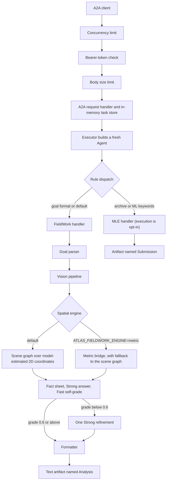

# Spatial Atlas Architecture

This document traces one request through Spatial Atlas, from the network to the returned artifact. It also describes the separate evaluation entry and states the limit of each guarantee. [GUIDE.md](GUIDE.md) shows how to run the system, and [EXPLAINED.md](EXPLAINED.md) explains the ideas behind it.

## 1. What the system is

Spatial Atlas is an agent for compute-grounded spatial reasoning, and it speaks the Agent-to-Agent (A2A) protocol. It records scene evidence in a typed structure and computes selected facts with ordinary code. A language model then writes the answer with those facts in its prompt. The default spatial engine does two-dimensional scene-graph arithmetic over model-estimated coordinates. The arithmetic gives the same result for the same inputs, but a language model supplies the coordinates, so the scene graph does not measure physical geometry.

The repository has two entry points into the same FieldWork code.

| Entry point | Caller | What it runs |
| --- | --- | --- |
| `src/server.py` | An A2A client over HTTP | The request path in Section 2, with admission control, bearer-token auth, rule dispatch, and both handlers |
| `eval_bench.py` | An operator on the command line | The FieldWork handler called directly, with frozen run modes, strict metric checks, and label-free journals for strict QSpatial rows (Section 5) |

Both entry points call the same FieldWork handler, so they share the scene, reasoning, and formatting code. The evaluation entry does not start the server and does not use A2A.

## 2. The A2A request path



The subsections below follow the diagram from top to bottom.

### 2.1 Startup checks

`src/server.py` checks its settings before it accepts a request. Startup stops in any of these three cases.

1. The server binds to an address other than `127.0.0.1`, `::1`, or `localhost`, and `ATLAS_BEARER_TOKEN` is unset. The one exception is `ATLAS_ALLOW_UNAUTHENTICATED_PUBLIC=true`, which exists for tests and is not a deployment mode.
2. `ATLAS_BEARER_TOKEN` is set but has fewer than 32 characters.
3. `ATLAS_ENABLE_MLEBENCH_CODE_EXECUTION=true` is set, but `ATLAS_TRUSTED_ISOLATED_WORKER` is not `true` or `ATLAS_BEARER_TOKEN` is unset.

Startup also resolves the Fast, Standard, Strong, and Vision model tiers. It stops when a tier is empty or lacks a provider prefix such as `openai/`. The Fast tier defaults to `openai/gpt-4.1-mini`, and the other three tiers default to `openai/gpt-4.1`.

### 2.2 Admission control and bearer-token auth

The server wraps the A2A application in three layers. Each request passes through them in this order.

1. The concurrency limit runs first. Each request that is not GET, HEAD, or OPTIONS takes one request slot. `ATLAS_MAX_CONCURRENT_REQUESTS` sets the number of slots, and its default is 4. When every slot is busy, the server answers HTTP 503 and does not queue the request.
2. The bearer-token check runs second. When a token is configured, each request that is not GET, HEAD, or OPTIONS must carry the header `Authorization: Bearer <TOKEN>`. The server compares the header in constant time and answers HTTP 401 when it does not match.
3. The body limit runs third. The server reads the whole body before A2A parsing begins. It answers HTTP 413 when the body is larger than `ATLAS_MAX_REQUEST_BYTES`, which defaults to 64 MiB. It answers HTTP 400 when `Content-Length` is not an integer.

Read-only requests skip the slot count and the token check. A GET to `/` returns an HTML landing page. A GET to `/.well-known/agent-card.json` returns the agent card, which lists two skills, `fieldwork-research` and `ml-engineering`.

### 2.3 A2A handling and the in-memory task store

The A2A SDK's `DefaultRequestHandler` parses the JSON-RPC request and hands the message to `src/executor.py`. Task records live in an `InMemoryTaskStore`. That store keeps tasks in process memory, so a restart loses every task. Two server processes cannot see each other's tasks.

The executor rejects a request that has no message. It also rejects a new message for a task that already reached a terminal state, which means completed, canceled, failed, or rejected. For an accepted message, it creates the task if needed, marks it as working, and builds a fresh `Agent` for this execution. The executor does not support cancellation.

A failed task returns a sanitized message with a short reference code, in the form `Spatial Atlas could not complete this task. Reference: <id>`. The server log records the same reference and the exception type. The client does not receive exception text.

### 2.4 The Agent and rule dispatch

Each `Agent` in `src/agent.py` owns a `BudgetedLLMClient`. This client enforces a heuristic budget of 150,000 tokens for one execution. Before each model call, it estimates the prompt size and reserves that estimate plus the allowed completion under a lock. When the remaining budget cannot cover the prompt estimate, it refuses the call. Provider-reported usage remains the authoritative record, because the estimate is not exact tokenizer accounting.

The Agent splits the incoming A2A message into text and files. Text parts stay as text, and data parts become JSON text. A file part becomes a (name, MIME type, bytes) tuple when it carries inline bytes. The Agent ignores a file part that carries only a URI.

Rule dispatch in `_classify_domain` then picks a handler. It applies four fixed string rules in order, and no model call takes part.

1. A file whose name contains `competition` or ends in `.tar.gz`, or whose MIME type contains `gzip`, sends the task to the MLE (machine learning engineering) handler.
2. Text that contains both `# Question` and `# Output Format` sends the task to the FieldWork handler.
3. Text that mentions `kaggle`, `mle-bench`, `competition`, `submission.csv`, or `train a model` sends the task to the MLE handler.
4. Every other task goes to the FieldWork handler.

The text rules ignore letter case.

### 2.5 The FieldWork handler

`src/fieldwork/handler.py` runs five stages in order.

1. The goal parser in `src/fieldwork/parser.py` splits the text at the `# Question`, `# Input Data`, and `# Output Format` headers. When it finds no question section, it treats the whole text as the question.
2. The vision pipeline in `src/fieldwork/vision.py` turns each file into text. The Vision-tier model describes each image. PDFs pass through `pypdf` text extraction. Videos are sampled into at most 30 frames, and at most 10 of those frames go to the vision model.
3. The spatial engine builds a scene, as Section 3 describes.
4. The reasoner writes the fact sheet into the prompt and generates the answer, as Section 2.6 describes.
5. The formatter shapes the answer to the requested output format, as Section 2.7 describes.

An optional Florence-2 detector can run before the vision model and add its object counts to the vision prompt. It runs only when `torch` and `transformers` are installed. The base dependencies do not include them, so a default install skips the detector. Detector counts can be wrong, and the pipeline does not check them.

The Agent returns the formatted answer as a text artifact named `Analysis`.

### 2.6 Generation with at most one refinement

`src/fieldwork/reasoner.py` builds one prompt from the question, the first 12,000 characters of file evidence, the fact sheet, and the output format. It then runs the sequence below.

```text
answer = Strong(question, evidence, fact_sheet, output_format)
grade  = FastSelfGrade(answer, evidence, question)      # a number from 0.0 to 1.0
if grade < 0.6:
    answer = StrongRefine(question, answer, evidence, fact_sheet, output_format)
return answer
```

The sequence makes at most one Strong-tier refinement. When the grading reply cannot be parsed, the grade defaults to 0.5, so a refinement runs. The grade is a routing heuristic. No study in this repository shows that it is calibrated, so a reader should not treat it as a probability of correctness. Setting `max_reflection_rounds` to 0 in `Config` skips both the grade and the refinement.

`src/entropy/engine.py` also defines an expected-information-gain action selector, but the request path never calls it. The tier router in `src/cost/router.py` is also unused on this path, because each model call names its tier directly.

### 2.7 The formatter

`src/fieldwork/formatter.py` checks the requested output format and applies the first rule that matches.

| The output format mentions | The formatter does this |
| --- | --- |
| `json`, or the format starts with `{` | It returns the first span that parses as JSON. It tries the whole answer, then fenced code blocks, then balanced brackets from longest to shortest. |
| `number`, `count`, `integer`, or `how many` | It returns the first number in the answer. |
| `yes/no`, `boolean`, `true/false`, or a similar phrase | It returns `yes` or `no`, or `true` or `false`, to match the requested vocabulary. |
| `list` or `comma` | It removes bullets and numbering and joins the items with commas. |
| Anything else | It strips Markdown code and emphasis markers. |

When a rule cannot extract a value, the formatter returns the raw answer unchanged.

## 3. The spatial engine

### 3.1 Default engine: a scene graph over model-estimated 2D coordinates

`SpatialAnalyzer.build_scene` in `src/fieldwork/spatial.py` sends the first 8,000 characters of file evidence to the Strong tier. It asks for JSON that lists entities, relations, zones, and safety rules. Each entity may carry `position_x` and `position_y`. The prompt calls these values meters, but the model estimates them from text descriptions of the image, so they are not measurements.

The code then runs deterministic operations over those estimates.

| Operation | What it computes |
| --- | --- |
| `compute_distance(i, j)` | It computes the Euclidean distance between two stored positions, `sqrt((xi - xj)^2 + (yi - yj)^2)`. |
| `compute_all_distances()` | It fills each relation that has no distance and rounds the value to two decimals. It keeps any distance the model already supplied. |
| `query_near(v, r)` | It lists the entities within radius `r` of entity `v`. |
| `check_constraints()` | It applies the extracted personal protective equipment (PPE) rules and distance rules and records each violation. |
| `to_fact_sheet()` | It writes entities, relations, zones, and violations as text for the answer prompt. |

This engine has four known limits.

- The scene does not record whether a stored distance came from the model or from `compute_distance`.
- `check_constraints()` treats a missing PPE, hard-hat, or safety-vest attribute as compliant, so missing evidence can hide a violation.
- When extraction fails or returns invalid JSON, the engine returns an empty scene, and the answer prompt then carries no fact sheet.
- Correct arithmetic cannot repair a wrong coordinate, so an error in the model's estimate carries into every fact derived from it.

### 3.2 Opt-in engine: the metric perception bridge

Setting `ATLAS_FIELDWORK_ENGINE=metric` tells the handler to build the scene from object masks and a reconstructed point map. The bridge in `src/fieldwork/perception.py` asks the Fast tier for up to six object phrases and segments each phrase with SAM3. It reconstructs a point map with Depth-Anything-3 and records a ground-plane (x, z) position and a visible height for each object. Reconstruction is also an estimate, so mask, depth, scale, and occlusion errors can reach the fact sheet.

The bridge reaches SAM3 and Depth-Anything-3 through NVIDIA's SpatialClaw GPU tool server. The bridge needs two external pieces, and this repository bundles neither of them.

- The SpatialClaw `spatial_agent` package must be importable. NVIDIA licenses SpatialClaw separately under the NVIDIA Source Code License-NC, which restricts it to non-commercial use. The [NOTICE](../NOTICE) file gives the details.
- A SpatialClaw GPU tool server must be reachable. NVIDIA's public SpatialClaw finds the server through the registry file `logs/gpu_server.json`. SpatialClaw polls for about four hours when that file lists no live server. My local SpatialClaw checkout adds a `SPATIALCLAW_GPU_SERVER_URL` override that pins one server address, so a call to an unreachable address fails within seconds. When that variable is unset, the bridge points it at a closed loopback port. NVIDIA's public release does not read this variable, so this default shortens the wait only with the local change.

On the A2A path, the generic metric engine has a documented fallback. When the bridge raises an error for any reason, the handler logs a warning and builds the default scene graph. The evaluation entry turns this fallback off, as Section 5 explains.

### 3.3 Strict QSpatial horizontal-gap checks

The evaluation entry can request a stricter protocol, `qspatial-horizontal-gap-v1`, for QSpatial rows that ask for the horizontal gap between two objects. This path follows six steps and has no fallback.

1. A frozen question grammar extracts the two object phrases from the raw benchmark question. A question outside the grammar fails to parse.
2. SAM3 supplies object masks, and Depth-Anything-3 supplies a point map with a confidence value for each point.
3. Each mask is eroded once with a disk whose radius depends on the ratio between mask size and point-map size. The bridge rejects masks that overlap by 5 percent or more, and it removes any smaller overlap from both masks.
4. The bridge keeps finite points with confidence above 0.3. It groups them into horizontal XZ voxels 5 mm wide and keeps one highest-confidence point per voxel. Each object needs at least 32 voxels, and the bridge keeps at most 50,000.
5. For each object, the bridge computes the nearest-neighbor distance from every voxel point to the other object and takes the fifth percentile. The gap is the smaller of the two directed values.
6. The gap must be finite and must lie in the range (0, 20] meters.

SpatialClaw's own mask helpers also filter point-map points by confidence, and its `get_centroid_3d` helper keeps points above a default threshold of 0.3. Its bird's-eye-view renderer also erodes object masks. The Atlas bridge uses its own scale-aware erosion radius and voxel estimator.

For voxel point sets A and B, step 5 computes the following values, and step 6 then checks the result.

$$d_{A \to B} = Q_{0.05}\left(\left\lbrace\min_{b \in B} \lVert a - b \rVert_{XZ} : a \in A\right\rbrace\right), \qquad \hat d(A, B) = \min\left(d_{A \to B}, d_{B \to A}\right)$$

After the bridge builds the scene, `validate_qspatial_gap_scene` checks it again. The scene must hold exactly two entities and one `horizontal_surface_gap` relation. The evidence must report valid geometry and no fallback, and its geometry and parser contract digests must match the contracts defined in the source. The relation distance must equal both the evidence gap and the smaller directed value. The evidence must also carry a 64-character voxel-key hash for each object.

When the service works but cannot produce valid geometry, the handler returns the explicit answer `measurement unavailable`. It returns that answer before the reasoner and the formatter run, and the evidence records the reason. The bridge never substitutes a centroid distance or a scene-graph estimate. A service error or a failed validation raises an error, and the evaluation entry records that error in the journal row.

## 4. The MLE handler

`src/mlebench/handler.py` accepts a Kaggle-style task with a competition archive. By default, it refuses to execute generated code, and the client receives the sanitized failure message from Section 2.3. Execution requires both `ATLAS_ENABLE_MLEBENCH_CODE_EXECUTION=true` and `ATLAS_TRUSTED_ISOLATED_WORKER=true`, and startup then also requires the bearer token. An operator should set these flags only inside an isolated, disposable worker.

When execution is enabled, the handler runs seven steps.

1. It extracts the archive under fixed limits of 512 MiB for the archive, 50,000 members, 4 GiB per member, and 8 GiB expanded.
2. It reads the competition description, lists the data files, and previews the tables.
3. The analyzer proposes a task type, a metric, and a strategy template.
4. The code generator writes a candidate pipeline.
5. `src/mlebench/executor.py` runs the pipeline in a subprocess with a 600-second timeout. The subprocess gets a minimal environment with a private home directory and temporary directory, and it inherits none of the parent's credentials. The executor caps the code at 2 MiB, each output stream at 8 MiB, and the submission at 64 MiB.
6. When the pipeline fails, the code generator repairs it from the captured error. The handler makes at most 3 attempts in total.
7. After a success, the handler parses `VALIDATION_SCORE` from the pipeline output. It then requests up to 2 refinements and keeps a refinement only when the parsed score improves in the direction the analyzer chose. It checks a 900-second budget before each refinement, but a refinement that has started runs under its own 600-second timeout.

When every attempt fails, the task fails. The handler produces a placeholder submission only when `ATLAS_ALLOW_DUMMY_SUBMISSION=true` is set separately. On success, the Agent returns an artifact named `Submission` that holds a text summary and `submission.csv`.

These controls reduce risk, but the subprocess is not a complete security sandbox. Generated code prints the validation score, so the score is a self-reported proxy that no independent check verifies. The code-generation prompt includes leak-audit guidance, and no separate component enforces it.

## 5. The evaluation entry

`eval_bench.py` loads a benchmark through the benchmark factory in a SpatialClaw checkout, and it calls the FieldWork handler directly on each row. It takes that checkout from `--spatialclaw-root` and also loads SpatialClaw's scoring helpers from it, so dataset parsing matches SpatialClaw's own code. `eval_bench.py` uses the base `LLMClient`, which records usage without the per-execution reservation. When `--engine metric` is chosen, `eval_bench.py` sets `fieldwork_metric_strict`, so a metric failure becomes a recorded error and never falls back to the scene graph.

The strict QSpatial arms also need a `qspatial_gap` benchmark loader that I wrote inside a local SpatialClaw checkout. NVIDIA's public SpatialClaw does not include this loader. The loader extends SpatialClaw's benchmark classes, so it falls under NVIDIA's Source Code License-NC. This repository does not include the loader for that reason.

### 5.1 The four frozen run modes

The four-arm design uses four separate invocations.

| Arm | Flags | What the handler receives |
| --- | --- | --- |
| Scene-graph path | `--engine scenegraph --image-mode correct` | The question and its own image |
| Question-only baseline | `--engine scenegraph --image-mode question-only` | The question with no image |
| Correct-image metric path | `--engine metric --image-mode correct` | The question and its own image, through the strict metric bridge |
| Schema-matched shuffled-image metric control | `--engine metric --image-mode shuffled --control-mapping <file>` | The question with a different image chosen by a frozen mapping |

The command line rejects mismatched combinations. Question-only mode requires the scene-graph engine, shuffled mode requires the metric engine, and a control mapping is valid only in shuffled mode. The image modes other than `correct` work only for label-free rows.

The shuffled-image control uses a frozen cyclic-next mapping over 84 images. Before a run, the driver checks the mapping's metadata and pair digest against digests that the operator supplies at run time. It confirms that each referenced image lies inside the image root and matches its recorded SHA-256. It rejects a fixed point, a repeated source, and any mapping that is not a bijection. It checks each control image's digest again when it reads the image.

### 5.2 Label-free journals

The driver writes `predictions.jsonl` under the `label_free_prescore_v1` schema for QSpatial horizontal-gap rows. Each row holds the prediction text, safe row metadata, usage counts, per-call telemetry, the wall-clock latency in seconds, the requested and used engine, the image mode, the input image digest, and the geometry status. The driver rejects any row or evidence record that contains a label-shaped key, such as `gt`, `ground_truth`, `answer`, `score`, `label`, or `gold`.

In this mode, `results_summary.json` holds operational counts and the mean latency, token counts, call count, and estimated cost. The driver never loads labels or runs the scorer in this mode. A `run_manifest.json` file pins the run settings, and `--resume` refuses to continue when the stored manifest does not match. For other SpatialClaw benchmarks, the driver can write a scored journal. This repository reports no score from either mode.

### 5.3 What the public source does not include

The public source provides the four run modes and their validators. It does not provide a one-command orchestrator that runs all four arms together. Each arm also needs pieces that this repository does not ship. The list includes SpatialClaw, the benchmark images, and the GPU tool server for the metric arms. It also includes the frozen control mapping and the digests of the private control artifacts. The public repository alone therefore cannot reproduce the V37 run in Section 6.

## 6. Evaluation status

This repository reports no FieldWorkArena result. FieldWorkArena remained gated and inaccessible, so the project did not run its validation set. The repository also reports no MLE-Bench result, because no sealed end-to-end run artifact exists for it.

The frozen V37 control suite passed 350 tests plus 63 subtests. That count comes from the dated V37 record, and it checks software behavior only. A local run of this repository's continuous integration (CI) test command on 2026-09-22 reported 323 passed and 1 deselected, with Python 3.13.

The only run-level evidence is one private four-arm smoke run, called V37. It ran with zero retries and produced 8 rows per arm, 32 rows in total. The boundary below is copied exactly from the project's evidence record. The record was written as guidance for anyone who describes the run, so it opens with an instruction to the writer.

> The new Spatial Atlas result is a label-free operational validation. Use this wording and no stronger interpretation:
>
> 1. Four operational paths ran together.
> 2. The paths were the scene-graph path, question-only baseline, correct-image metric path, and schema-matched shuffled-image metric control.
> 3. Each path produced eight label-free prescore prediction rows.
> 4. The total was 32 rows.
> 5. The execution, warning-scan, restoration, cleanup, and terminal-seal gates passed.
> 6. The run used zero retries.
> 7. Protected labels and ground truth remained sealed.
> 8. No score or paired comparison was computed.
> 9. This establishes operational integrity only.
>
> It does not establish:
>
> 1. Accuracy.
> 2. Superiority over another path or system.
> 3. A causal or ablation effect.
> 4. Statistical significance.
> 5. An uncertainty interval.
> 6. Calibration.
> 7. Benchmark ranking.
> 8. Production readiness.
> 9. A cost or latency result.
> 10. Native SpatialClaw persistent-kernel integration.
>
> The local regression suite reported 350 tests plus 63 subtests in the dated V37 record. Treat that as `LOCAL_REGRESSION_PASS`, not benchmark accuracy.
>
> Prediction journals are not answer-level evidence-use journals. The terminal finalizer is not an answer verifier. The V37 metric arm used SpatialClaw perception primitives through the Atlas bridge, but V37 did not run a native SpatialClaw persistent-kernel arm.

## 7. Module map

| Path | Role |
| --- | --- |
| `src/server.py` | A2A server, startup checks, admission control, bearer-token auth, landing page, and agent card |
| `src/executor.py` | Task lifecycle, a fresh Agent per execution, and sanitized failures |
| `src/agent.py` | Message parsing, rule dispatch, and artifacts |
| `src/budgeted_llm.py` | Heuristic per-execution token budget |
| `src/llm.py` | LiteLLM wrapper with usage tracking |
| `src/config.py` | Model tiers and tunable settings |
| `src/fieldwork/parser.py` | Goal parser |
| `src/fieldwork/vision.py`, `src/fieldwork/detector.py` | Image, PDF, video, and text processing, with an optional Florence-2 detector |
| `src/fieldwork/spatial.py` | Scene graph, deterministic operations, and fact sheet |
| `src/fieldwork/perception.py` | Metric perception bridge and strict QSpatial checks |
| `src/fieldwork/reasoner.py` | Answer, self-grade, and at most one refinement |
| `src/fieldwork/formatter.py` | Output-format matching |
| `src/entropy/engine.py` | Self-grade, plus an action selector that the request path does not call |
| `src/cost/` | Usage tracker, plus a tier router that the request path does not call |
| `src/mlebench/` | Opt-in MLE handler, executor, code generator, and strategy templates |
| `eval_bench.py` | Evaluation entry with four frozen run modes and label-free journals for strict QSpatial rows |
| `eval_smoke.py` | One synthetic A2A request against a running server |

## 8. Limits of this architecture

This architecture establishes an inspectable boundary between model-proposed evidence, deterministic computation, and language generation. It does not establish the claims below.

- It establishes no accuracy, superiority, causal effect, statistical significance, calibration, benchmark ranking, production readiness, cost, or latency result.
- The default scene graph computes over model-estimated coordinates and does not measure physical geometry.
- No study in this repository shows that the FieldWork self-grade is calibrated.
- The prediction journals do not record which evidence an answer used.
- NVIDIA's SpatialClaw uses a persistent code-action kernel, and that kernel remains proposed future work for Spatial Atlas. An answer-level evidence-use journal and an answer verifier also remain proposed.
