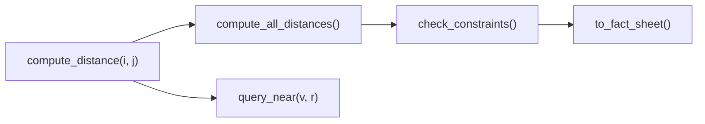

# Spatial Atlas Explained

This document explains the ideas behind Spatial Atlas, starting from its basic design. It keeps five kinds of statements apart. They are what this repository implements, what a local test gate showed, what one label-free run showed, what belongs to NVIDIA's upstream SpatialClaw, and what remains proposed. The document reports one private label-free operational run and two local test results, and it reports no benchmark score.

[ARCHITECTURE.md](ARCHITECTURE.md) gives the full request path, and [GUIDE.md](GUIDE.md) shows how to run the system.

## 1. Read the evidence label first

Each technical section below carries one of these labels.

| Label | Meaning |
| --- | --- |
| Implementation | The behavior is visible in this repository's source code. |
| Local regression pass | A named local test suite passed against a frozen control. |
| Label-free operational smoke | A private run executed and closed without opening labels or computing a score. |
| Upstream SpatialClaw | The mechanism belongs to NVIDIA's SpatialClaw project and not to Spatial Atlas. |
| Proposed | The design is a target or next step that has not run end to end. |

Each label names a different kind of evidence, and no label can replace another. A passing test shows the behavior it exercises. A deterministic calculation can still start from a wrong input, and a completed run can still produce wrong answers.

Earlier versions of this project reported benchmark tables. Those values could not be tied to sealed run artifacts, so this repository and its revised manuscript withdraw them. The revised manuscript in `paper/` is not yet on arXiv. The earlier version remains on arXiv as [2604.12102v2](https://arxiv.org/abs/2604.12102v2).

## 2. The idea in plain terms

Suppose an AI system looks at a warehouse photograph and says that the pallet is two meters from the barrier. It may give that number because the distance looks typical for similar images. It may never have measured or calculated anything.

Spatial Atlas splits the work into three steps.

1. A model records the objects, positions, relations, attributes, and rules that appear in the scene.
2. Ordinary code computes selected facts from that record, such as distances, nearby objects, and rule violations.
3. A language model writes the answer with the computed facts in its prompt.

This order is called compute-grounded reasoning, or CGR.

Correct arithmetic cannot fix a wrong record. In the default engine, a language model estimates the scene coordinates. The arithmetic over those coordinates always gives the same result for the same input, but the coordinates are not measured geometry.

## 3. The research question

The project starts from one question. When an agent can compute a fact, why should it ask a language model to guess that fact?

An answer-only score tells us whether the final text matches a reference. It usually cannot tell us whether the answer came from inspected evidence, a calculation, a memorized pattern, or luck.

CGR makes more of the process open to inspection. In the full design, a reader could look at the entities and relations given to the computation and at the operation that derived each fact. The reader could also see the facts placed in the final prompt and the answer before and after a refinement.

This repository carries out only part of that plan. Its code keeps the structured state and the deterministic operations in separate, testable steps. The A2A path returns only the formatted answer as the `Analysis` artifact. The server log records scene counts and the self-grade. It does not record the scene graph, the fact sheet, or the answer before refinement. The repository does not yet record which facts an answer used, and it has no verifier that checks an answer against its evidence.

## 4. How a request moves through the system

*Evidence label: Implementation*

Spatial Atlas began as an entry for the AgentX-AgentBeats competition, which Berkeley's Center for Responsible, Decentralized Intelligence (RDI) runs. That competition sends FieldWorkArena questions and MLE-Bench tasks to one agent, so Spatial Atlas runs as one A2A server with two handlers. A request follows the path below, and rule dispatch in step 3 sends it to exactly one of the two handlers in steps 4 and 5.

1. The server applies a concurrency limit, a bearer-token check, and a body-size limit.
2. The A2A handler keeps the task in an in-memory task store, and the executor builds a fresh agent for the execution.
3. Rule dispatch uses fixed string rules to send the task to the FieldWork handler or the MLE handler.
4. The FieldWork handler parses the goal, turns each file into text, builds a scene, generates an answer, and formats it.
5. The MLE handler refuses to execute generated code unless an operator has opted in inside an isolated worker.

A separate evaluation entry, `eval_bench.py`, calls the FieldWork handler directly for frozen benchmark runs. [ARCHITECTURE.md](ARCHITECTURE.md) gives every setting and limit.

## 5. The FieldWork path

*Evidence label: Implementation*

### 5.1 Typed state

The scene is a typed graph. A vertex stores one proposed entity, and an edge stores a proposed relation between two entities.

$$v_i = \mathrm{SpatialEntity}(\mathrm{id}_i, \ell_i, \mathrm{pos}_i, \mathrm{attrs}_i, z_i)$$

$$e_{ij} = \mathrm{SpatialRelation}(i, p_{ij}, j, d_{ij})$$

In these formulas, $\mathrm{id}_i$ is the entity's string ID, $\ell_i$ is a label such as `worker`, and $\mathrm{pos}_i$ is an optional (x, y) position. The symbol $\mathrm{attrs}_i$ is a dictionary of attributes such as a hard-hat flag, and $z_i$ is the zone. The symbol $p_{ij}$ is a predicate word such as `near`, and $d_{ij}$ is an optional distance.

For positions $\mathrm{pos}_i = (x_i, y_i)$ and $\mathrm{pos}_j = (x_j, y_j)$, `compute_distance(i, j)` returns the Euclidean distance.

$$d(i, j) = \sqrt{(x_i - x_j)^2 + (y_i - y_j)^2}$$

The operation always returns the same value for the same stored numbers. Its physical accuracy depends entirely on the coordinates that the model supplied.

### 5.2 The computation graph



Each node has one job.

- `compute_distance(i, j)` computes one pairwise distance from stored positions.
- `compute_all_distances()` fills the distance of each relation that has none, and it keeps any distance the model already supplied.
- `query_near(v, r)` lists the entities within radius r of entity v.
- `check_constraints()` applies the personal protective equipment (PPE) rules and the distance rules that the model extracted.
- `to_fact_sheet()` writes entities, relations, zones, and violations as text for the answer prompt.

### 5.3 What the graph establishes

The graph separates model-proposed scene evidence from the deterministic work done over it. It also separates both of them from the final language generation. This separation supports inspection and targeted tests. It does not show that the scene evidence is physically correct.

### 5.4 What the graph does not establish

The default engine has five limits.

- It does not recover metric scale from the image.
- It does not measure three-dimensional geometry.
- It gives no uncertainty interval for a distance.
- It does not record whether a distance came from the model or from code.
- It does not prove that the answer used a particular fact.

Missing evidence needs special care. `check_constraints()` treats an absent PPE, hard-hat, or safety-vest attribute as compliant, so missing evidence can hide a violation. A safety-oriented deployment should treat an absent attribute as unknown and decline the claim when the evidence is missing.

## 6. Confidence-gated refinement

### 6.1 The formulation

*Evidence label: Proposed*

The manuscript describes an entropy-guided policy. At step $t$, a knowledge state $\mathcal K_t$ holds the observations, computed facts, and intermediate conclusions gathered so far. The answer entropy measures how uncertain the answer still is.

$$H(\mathcal A \mid \mathcal K_t) = -\sum_{a \in \mathcal A} P(a \mid \mathcal K_t) \log P(a \mid \mathcal K_t)$$

The policy would pick the candidate action $c_j$ with the largest expected entropy reduction.

$$c^\star = \arg\max_{c_j} \mathbb E\left[H(\mathcal A \mid \mathcal K_t) - H(\mathcal A \mid \mathcal K_t \cup \mathrm{obs}(c_j))\right]$$

These equations state an intended objective. The current FieldWork path does not compute them.

### 6.2 The controller that runs

*Evidence label: Implementation*

```text
answer = Strong(question, evidence, fact_sheet, output_format)
grade  = FastSelfGrade(answer, evidence, question)
if grade < 0.6:
    answer = StrongRefine(question, answer, evidence, fact_sheet, output_format)
return answer
```

The controller makes one Strong-tier answer, one Fast-tier self-grade, and at most one Strong-tier refinement. It computes no expected information gain. When the grade cannot be parsed, the code uses 0.5, which triggers the refinement. No reliability curve or threshold study supports the value 0.6. The grade is a routing heuristic, and a reader should not treat it as a probability of correctness.

## 7. The metric perception bridge

*Evidence label: Implementation, with external dependencies*

The default engine works from model-estimated coordinates. The metric bridge computes positions from object masks and a reconstructed point map. It calls SAM3 segmentation and Depth-Anything-3 reconstruction through NVIDIA's SpatialClaw GPU tool server. The perception models have their own authors and licenses.

The bridge has two modes, and they treat failure differently.

- The generic metric engine serves the A2A path when `ATLAS_FIELDWORK_ENGINE=metric` is set. It has a documented fallback. When the bridge is unavailable, the handler logs a warning and uses the default scene graph.
- The strict QSpatial bridge serves the evaluation entry and never falls back. When it cannot produce valid geometry, it returns the explicit answer `measurement unavailable` and records the reason.

The strict bridge estimates the horizontal gap between two visible object surfaces in six steps.

1. It erodes each object mask once to reduce contamination at the mask boundary.
2. It keeps finite points with confidence above 0.3.
3. It groups the points into horizontal XZ voxels 5 mm wide and keeps the highest-confidence point in each voxel.
4. It computes the fifth percentile of nearest-neighbor distances in each direction.
5. It takes the smaller directed value as the gap estimate.
6. It checks the range, the provenance, the protocol contracts, and the evidence hashes before it returns the value.

For reconstructed object point sets $A$ and $B$, steps 4 and 5 compute the following values.

$$d_{A \to B} = Q_{0.05}\left(\left\lbrace\min_{b \in B} \lVert a - b \rVert_{XZ} : a \in A\right\rbrace\right)$$

$$\hat d(A, B) = \min\left(d_{A \to B}, d_{B \to A}\right)$$

The fifth percentile reduces the effect of a single stray point. It does not solve occlusion, recover hidden surfaces, or turn reconstructed depth into physical ground truth. Mask, depth, scale, visibility, and reconstruction errors can all reach the reported value. A safety-oriented system should report coverage and uncertainty, and it should decline a claim when the needed surfaces are not visible.

This repository contains the bridge code and its validators. It does not contain SpatialClaw, the GPU service, the benchmark images, or the frozen control artifacts, so the bridge cannot run from this repository alone.

## 8. The evaluation design

*Evidence label: Implementation*

The evaluation entry supports four arms, and each arm is a separate run.

| Arm | Engine | Image the handler sees |
| --- | --- | --- |
| Scene-graph path | Scene graph | The row's own image |
| Question-only baseline | Scene graph | No image |
| Correct-image metric path | Strict metric bridge | The row's own image |
| Schema-matched shuffled-image metric control | Strict metric bridge | A different image chosen by a frozen mapping |

The shuffled-image control uses the same metric engine, question, and journal schema as the correct-image arm. It changes only the image that supplies the geometry. The design aims to separate any effect of correct geometry from any effect of structured prompting. That comparison needs protected scoring, and nobody has performed it.

The code validates the control mapping before a run. The mapping must cover exactly 84 images, contain no fixed point, and form a bijection. Every image must match its recorded digest. A resumed run must match the stored run manifest, and the code rejects an incompatible resume.

Each arm writes a label-free journal. A journal row holds the prediction text and safe metadata, and the code rejects any row that contains a label-shaped field. These journals record model outputs before scoring. They are not answer-level evidence-use journals, and they do not show which evidence an answer used.

The public source provides the four run modes and their validators. It does not provide a one-command orchestrator for all four arms.

## 9. Current evaluation status

### 9.1 Local regression pass

*Evidence label: Local regression pass*

The frozen V37 control suite passed 350 tests plus 63 subtests. The suite checks software behavior only, and its count is not benchmark accuracy. A local run of this repository's continuous integration (CI) test command on 2026-09-22 reported 323 passed and 1 deselected, with Python 3.13. This public run checks the code in this repository, and it did not run against the frozen V37 control.

### 9.2 Label-free operational smoke

*Evidence label: Label-free operational smoke*

One private four-arm smoke run, called V37, ran with zero retries. It produced 8 rows per arm and 32 rows in total. The boundary below is copied exactly from the project's evidence record, and it states everything the run shows. The record was written as guidance for anyone who describes the run, so it opens with an instruction to the writer.

> The new Spatial Atlas result is a label-free operational validation. Use this wording and no stronger interpretation:
>
> 1. Four operational paths ran together.
> 2. The paths were the scene-graph path, question-only baseline, correct-image metric path, and schema-matched shuffled-image metric control.
> 3. Each path produced eight label-free prescore prediction rows.
> 4. The total was 32 rows.
> 5. The execution, warning-scan, restoration, cleanup, and terminal-seal gates passed.
> 6. The run used zero retries.
> 7. Protected labels and ground truth remained sealed.
> 8. No score or paired comparison was computed.
> 9. This establishes operational integrity only.
>
> It does not establish:
>
> 1. Accuracy.
> 2. Superiority over another path or system.
> 3. A causal or ablation effect.
> 4. Statistical significance.
> 5. An uncertainty interval.
> 6. Calibration.
> 7. Benchmark ranking.
> 8. Production readiness.
> 9. A cost or latency result.
> 10. Native SpatialClaw persistent-kernel integration.
>
> The local regression suite reported 350 tests plus 63 subtests in the dated V37 record. Treat that as `LOCAL_REGRESSION_PASS`, not benchmark accuracy.
>
> Prediction journals are not answer-level evidence-use journals. The terminal finalizer is not an answer verifier. The V37 metric arm used SpatialClaw perception primitives through the Atlas bridge, but V37 did not run a native SpatialClaw persistent-kernel arm.

The public repository cannot reproduce V37. The run used a combined orchestration in a separate private execution environment. The external perception service, the benchmark images, and the frozen control artifacts are not bundled with this repository.

### 9.3 No benchmark result

This repository reports no FieldWorkArena result. FieldWorkArena remained gated and inaccessible, so the project did not run its validation set. The repository also reports no MLE-Bench result, because no sealed end-to-end run artifact exists. It reports no cost, latency, or routing-savings figure.

## 10. The MLE path

*Evidence label: Implementation*

The MLE handler applies the compute-first idea to generated pipeline code, and its code execution is opt-in.

1. By default, the handler refuses to execute generated code, and the task fails with a sanitized message.
2. Execution needs both `ATLAS_ENABLE_MLEBENCH_CODE_EXECUTION=true` and `ATLAS_TRUSTED_ISOLATED_WORKER=true`, plus a bearer token of at least 32 characters.
3. An enabled run makes at most 3 attempts. Each attempt runs in a subprocess with a 600-second timeout and a minimal environment.
4. After a successful run, the handler parses `VALIDATION_SCORE` from the output. It keeps a refinement only when that parsed score improves.
5. A placeholder submission requires a separate opt-in, `ATLAS_ALLOW_DUMMY_SUBMISSION=true`.

The score-gated rule guarantees only that the parsed proxy score does not get worse, in the direction the analyzer chose. Generated code prints that score, so its reliability depends on the validation split that the generated code builds. The code-generation prompt asks the pipeline to check for leakage, such as overlapping IDs. No separate component enforces those checks. The subprocess reduces risk, but it is not a complete security sandbox.

## 11. SpatialClaw and how it relates

*Evidence label: Upstream SpatialClaw*

SpatialClaw is a separate, training-free framework from NVIDIA by Cho and colleagues. It uses code as an action interface. Its agent writes one Python cell at each step into a persistent Jupyter kernel, and each cell passes an abstract syntax tree (AST) check first. The agent reads each intermediate output and can compose, recompute, or revise operations before it answers. SpatialClaw also wraps SAM3, Depth-Anything-3, and geometry utilities as tools.

Spatial Atlas calls SpatialClaw's perception service through its metric bridge, and the V37 metric arms used those primitives. SpatialClaw reports its own benchmark results under its own tasks, models, and perception stack. Those results belong to SpatialClaw, and they are not Spatial Atlas results.

NVIDIA licenses SpatialClaw under the NVIDIA Source Code License-NC, which restricts it to non-commercial use. This repository does not include SpatialClaw's source files, and its own license does not cover SpatialClaw. The function `_benchmark_instruction` in `eval_bench.py` has about ten lines derived from SpatialClaw's `spatial_agent/entrypoints/run.py`, and it stays under NVIDIA's license. The [NOTICE](../NOTICE) file gives the details.

## 12. Proposed work

*Evidence label: Proposed*

Three additions would make the CGR claim testable for individual answers.

1. A persistent code-action kernel would let Spatial Atlas inspect, compose, recompute, and revise operations over its evidence state. NVIDIA's SpatialClaw uses this mechanism.
2. An answer-level evidence-use journal would record the exact facts and tool outputs that each answer consumed.
3. An answer verifier would count an answer only when its evidence is fresh, valid, and attested.

The next scientific step is protected scoring of the four arms. Paired analysis and uncertainty analysis would follow, under an interpretation boundary fixed in advance. Nobody has performed any of these steps yet.

## 13. What this project contributes

The strongest contribution that this repository supports is an inspectable computation boundary.

- The A2A server applies admission control and bearer-token auth, and it routes tasks with fixed rules.
- The FieldWork path builds a typed scene graph and computes selected facts deterministically.
- The fact sheet places those facts in the answer prompt.
- The controller makes at most one refinement when the self-grade falls below 0.6.
- The strict metric bridge returns an explicit unavailable result instead of silently falling back.
- The evaluation entry supports four frozen run modes with label-free journals.
- The hardened MLE path keeps generated-code execution opt-in.

The contribution shows where evidence enters, where code derives a fact, and where language generation begins. It does not solve geometric perception.

## 14. Open questions

1. Does correct geometry help when the schema, prompt structure, and token budget stay fixed?
2. How should graph queries and constraints propagate uncertainty and handle missing evidence?
3. Can the metric bridge reliably decline unsupported clearance questions?
4. Which validation evidence makes a generated MLE score trustworthy?
5. Can an evidence-use journal show which facts an answer consumed?
6. Can a verifier reject stale, invalid, or unattested evidence before scoring?

## 15. Claim checklist

These statements are safe to make about this repository.

- Spatial Atlas is an A2A agent for compute-grounded spatial reasoning.
- The default spatial engine does 2D scene-graph arithmetic over model-estimated coordinates.
- The strict metric bridge returns an explicit unavailable result. The generic metric engine has a documented fallback.
- The evaluation entry provides four run modes, which are the scene-graph path, the question-only baseline, the correct-image metric path, and the schema-matched shuffled-image metric control.
- The journals for strict QSpatial horizontal-gap rows are label-free. The driver can also write a scored journal for other benchmarks, and this repository reports no score from it.
- The hardened MLE path is opt-in.
- This repository's CI test command reported 323 passed and 1 deselected on 2026-09-22 with Python 3.13.

These statements are safe to make about the private V37 record.

- The frozen V37 control suite passed 350 tests plus 63 subtests.
- One private four-arm smoke run used zero retries and produced 8 rows per arm, 32 rows in total.

These statements need attribution to NVIDIA's SpatialClaw.

- The persistent, AST-checked Python action loop belongs to SpatialClaw.
- The SAM3, Depth-Anything-3, and geometry wrappers belong to SpatialClaw.
- Every SpatialClaw benchmark result belongs to SpatialClaw.

These statements are proposed future work only.

- Spatial Atlas may later integrate a persistent code-action kernel.
- Spatial Atlas may later add an answer-level evidence-use journal.
- Spatial Atlas may later add an answer verifier.

These claims are not supported, and nobody should make them.

- Do not claim any accuracy, superiority, causal, significance, calibration, ranking, production-readiness, cost, or latency result.
- Do not claim that the scene graph measures physical geometry.
- Do not claim that this repository reproduces V37.
- Do not claim that SpatialClaw results belong to Spatial Atlas.
- Do not call the prediction journals evidence-use journals, and do not call the terminal finalizer an answer verifier.
- Do not claim that the revised manuscript is on arXiv.
- Do not claim that the self-grade is calibrated or that the MLE executor is a complete sandbox.

## 16. Sources

The source code in this repository supports every implementation statement above. The most relevant files are `src/fieldwork/spatial.py`, `src/fieldwork/perception.py`, `src/fieldwork/reasoner.py`, `src/mlebench/handler.py`, and `eval_bench.py`. The other sources are listed here.

- The revised manuscript is in `paper/`, and it is not yet on arXiv.
- The earlier version of the paper is [arXiv 2604.12102v2](https://arxiv.org/abs/2604.12102v2). That version reports values that this repository withdraws.
- SpatialClaw code is at [github.com/NVlabs/SpatialClaw](https://github.com/NVlabs/SpatialClaw).
- The SpatialClaw project page is at [spatialclaw.github.io](https://spatialclaw.github.io).

## 17. Summary

Spatial Atlas makes an agent's evidence and deterministic work visible before language generation. This document also keeps that implementation separate from upstream SpatialClaw, from the one label-free operational run, and from proposed verification work.
